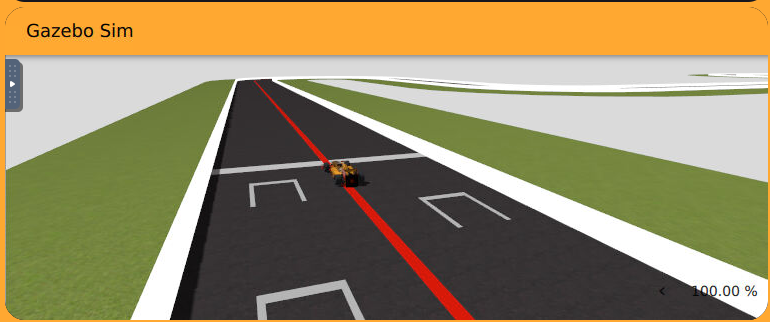
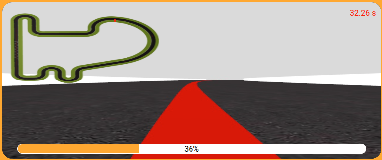
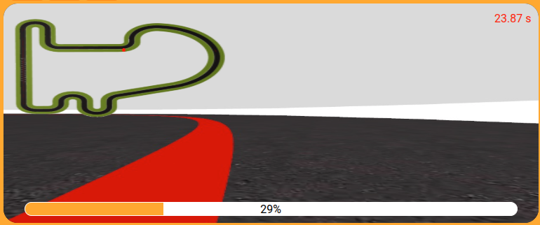
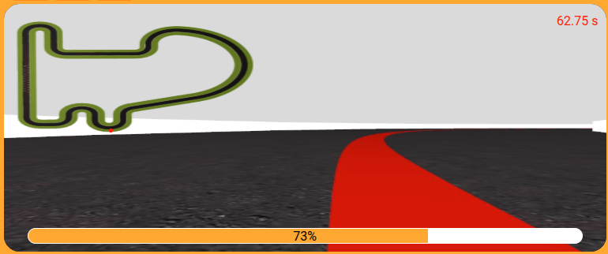
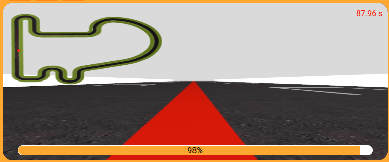

# 🚗 Práctica 1: Seguimiento visual de una línea

---

## 👨‍💻 Autor

**Taref Bilel**
**Máster en Visión Artificial**
**Asignatura:** Visión Robótica

---

## 📘 Introducción

En esta práctica he trabajado con un problema muy importante en robótica móvil: conseguir que un robot siga una línea usando solamente la información de su cámara.

La idea principal de mi trabajo fue hacer que el robot pudiera mirar el suelo, detectar una línea roja y moverse siguiendo esa línea. Para conseguirlo, yo combiné dos partes importantes: visión por computador y control del robot.

Primero, usé técnicas de procesamiento de imagen para encontrar la línea roja dentro de la imagen de la cámara. Después, calculé dónde estaba esa línea respecto al centro de la imagen. Finalmente, usé esa información para mandar velocidades al robot y corregir su dirección.

Es decir, lo que hice fue enseñar al robot a tomar una decisión simple:

* Si la línea está en el centro, el robot sigue recto.
* Si la línea está a la izquierda, el robot gira hacia la izquierda.
* Si la línea está a la derecha, el robot gira hacia la derecha.
* Si no ve la línea, intenta buscarla otra vez.

Este tipo de ejercicio es muy útil para entender cómo un robot puede usar una cámara para navegar de manera autónoma. Aunque el problema parece simple, tiene partes importantes como la detección de color, el cálculo del error y el control del movimiento.

---

## 🎯 Objetivo

El objetivo de esta práctica fue diseñar e implementar un sistema para que un robot pudiera seguir una línea roja de forma automática.

Para hacerlo, yo tuve que resolver varios pasos:

* Capturar imágenes con la cámara del robot.
* Procesar esas imágenes para encontrar el color rojo.
* Crear una máscara para separar la línea roja del fondo.
* Usar solo la parte inferior de la imagen, porque es la zona más cercana al robot.
* Calcular la posición de la línea dentro de la imagen.
* Comparar esa posición con el centro de la imagen.
* Usar un controlador PD para corregir la dirección.
* Cambiar la velocidad del robot dependiendo del error.
* Añadir un mecanismo para recuperar la línea cuando no se detecta.

Mi objetivo no era solo que el robot siguiera la línea, sino que lo hiciera de forma estable, sin muchos movimientos bruscos y sin perder la línea en las curvas.

---

## ⚙️ Metodología

En esta sección explico paso a paso lo que hice en la práctica.

---

### 1. Captura de imagen

Lo primero que hice fue obtener imágenes continuamente desde la cámara del robot.

La cámara es como los ojos del robot. El robot no sabe dónde está la línea si no mira primero el suelo. Por eso, en cada momento, el robot captura una imagen y después yo proceso esa imagen para buscar la línea roja.

El proceso general que seguí fue este:

1. El robot captura una imagen.
2. Yo convierto la imagen a otro espacio de color.
3. Busco los píxeles rojos.
4. Calculo dónde está la línea.
5. Calculo el error.
6. Mando velocidades al robot.

De esta forma, el robot va tomando decisiones en tiempo real.

---

### 2. Conversión de BGR a HSV

Las imágenes que recibí estaban en formato BGR, que es el formato típico usado por OpenCV. Pero para detectar colores, yo decidí convertir la imagen al espacio HSV.

```python
hsv = cv2.cvtColor(image, cv2.COLOR_BGR2HSV)
```

Yo hice esta conversión porque HSV es más cómodo para trabajar con colores. En BGR, el color puede cambiar mucho cuando cambia la iluminación. En cambio, en HSV, el color está más separado de la intensidad de la luz.

Esto es importante porque en una imagen real puede haber zonas más claras o más oscuras. Entonces, si yo uso directamente BGR, la detección del rojo puede ser menos estable. Por eso usé HSV, porque me ayuda a detectar mejor la línea roja aunque haya pequeñas variaciones de luz.

---

### 3. Detección del color rojo

Después de convertir la imagen a HSV, el siguiente paso que hice fue detectar el color rojo.

El color rojo en HSV tiene una particularidad: aparece en dos zonas del rango de color. Por eso, yo no usé una sola máscara, sino dos máscaras diferentes.

```python
mask1 = cv2.inRange(hsv, lower_red1, upper_red1)
mask2 = cv2.inRange(hsv, lower_red2, upper_red2)

mask = mask1 + mask2
```

Primero, definí un rango para detectar una parte del rojo. Después, definí otro rango para detectar la otra parte del rojo. Luego sumé las dos máscaras para tener una sola imagen con todas las zonas rojas detectadas.

El resultado es una imagen binaria.

En esta imagen:

* El color blanco representa los píxeles donde yo detecté rojo.
* El color negro representa las zonas donde no hay rojo.

Esto me permitió simplificar mucho el problema. En vez de analizar toda la imagen con todos sus colores, yo me quedé solamente con la información importante: la posición de la línea roja.

---

### 4. Región de interés

Después de crear la máscara, yo no usé toda la imagen completa. Decidí usar solamente la parte inferior de la imagen.

```python
roi = mask[int(h*0.6):h, :]
```

Hice esto porque la parte inferior de la imagen representa la zona más cercana al robot. Esa zona es la más importante para controlar el movimiento, porque es donde la línea afecta directamente a la dirección actual del robot.

Por ejemplo, si hay una parte de la línea muy lejos en la imagen, no es tan importante para la corrección inmediata. Lo importante es saber dónde está la línea justo delante del robot.

Esta decisión tiene varias ventajas:

* El procesamiento es más rápido.
* Hay menos ruido en la imagen.
* El robot se concentra en la zona más útil.
* Se evitan posibles errores con objetos rojos que estén lejos.

Entonces, en esta parte yo reduje la imagen al área que realmente necesitaba para controlar el robot.

---

### 5. Cálculo de la posición de la línea

Cuando ya tenía la máscara de la línea roja en la región de interés, necesitaba saber dónde estaba la línea exactamente.

Para eso usé los momentos de imagen.

```python
moments = cv2.moments(roi)
cx = int(moments["m10"] / moments["m00"])
```

Con los momentos de imagen pude calcular el centro de la zona blanca de la máscara. Ese centro representa aproximadamente la posición horizontal de la línea roja.

El valor `cx` me dice dónde está la línea en el eje horizontal de la imagen.

Por ejemplo:

* Si `cx` está cerca del centro de la imagen, el robot está bien alineado.
* Si `cx` está más a la izquierda, significa que la línea está a la izquierda.
* Si `cx` está más a la derecha, significa que la línea está a la derecha.

También tuve en cuenta que puede pasar que no se detecte ninguna línea. En ese caso, el momento `m00` puede ser cero. Si eso ocurre, no puedo calcular `cx`, porque no hay línea detectada.

Por eso, antes de usar el centroide, es importante comprobar que realmente hay píxeles blancos en la máscara.

---

### 6. Cálculo del error

Después de calcular la posición de la línea, yo calculé el error respecto al centro de la imagen.

```python
error = cx - center
```

Aquí, `cx` es la posición de la línea y `center` es el centro de la imagen.

El error me dice cuánto se ha desplazado la línea respecto al centro.

Lo interpreté así:

* Si el error es cercano a cero, el robot está bien centrado.
* Si el error es positivo, la línea está hacia la derecha.
* Si el error es negativo, la línea está hacia la izquierda.
* Si el error es grande, el robot necesita corregir más.

Esta parte es muy importante porque el robot no entiende directamente la imagen. Yo tuve que convertir la información visual en un número. Ese número es el error, y después lo usé para controlar el giro del robot.

En palabras simples, el error responde a esta pregunta:

**¿Cuánto se ha separado la línea del centro de la cámara?**

---

### 7. Controlador PD

Después de calcular el error, yo necesitaba transformar ese error en una orden de giro para el robot.

Para eso usé un controlador PD.

```python
derivative = error - previous_error
previous_error = error

w_cmd = -Kp * error - Kd * derivative
```

Yo usé un controlador PD porque es simple y funciona bien para este tipo de problema.

El controlador PD tiene dos partes:

### Parte proporcional

La parte proporcional depende del error actual.

Si el error es grande, el robot gira más.
Si el error es pequeño, el robot gira menos.

Esto ayuda al robot a corregir su dirección.

### Parte derivativa

La parte derivativa depende de cómo cambia el error entre una imagen y la siguiente.

Yo usé esta parte para hacer el movimiento más suave. Si el error cambia muy rápido, la parte derivativa ayuda a evitar giros demasiado bruscos.

Esto es importante porque, sin esta parte, el robot puede empezar a moverse de izquierda a derecha de forma inestable.

Después, limité la velocidad angular para que el robot no girara demasiado fuerte.

```python
w_cmd = max(min(w_cmd, w_cmd_max), -w_cmd_max)
```

Con este límite, aunque el error sea grande, el robot no puede girar con una velocidad angular excesiva. Esto hace que el comportamiento sea más seguro y más estable.

---

### 8. Control adaptativo de la velocidad

Además del giro, yo también controlé la velocidad lineal del robot.

No quería que el robot fuera siempre a la misma velocidad. Si el robot está en una recta, puede ir más rápido. Pero si está en una curva, es mejor que vaya más lento.

Por eso hice que la velocidad dependiera del error.

```python
speed = 6 - abs(error) * 0.02
speed = max(2.5, min(6, speed))
```

La idea es esta:

* Cuando el error es pequeño, el robot va más rápido.
* Cuando el error es grande, el robot va más lento.
* En las curvas, normalmente el error aumenta, entonces el robot reduce la velocidad.
* En las rectas, el error es pequeño, entonces el robot puede avanzar más rápido.

También puse un valor mínimo y un valor máximo para la velocidad.

Esto es importante porque no quería que el robot se parara totalmente, pero tampoco quería que fuera demasiado rápido.

Con este control adaptativo, el robot se comporta mejor en las curvas y tiene menos riesgo de perder la línea.

---

### 9. Mecanismo de recuperación

También añadí un mecanismo de recuperación para cuando el robot no detecta la línea roja.

Esto puede pasar si el robot se desvía mucho, si la línea sale de la imagen o si la detección falla en algún momento.

En ese caso, no puedo calcular el centro de la línea ni el error. Por eso, hice que el robot girara para intentar encontrar la línea otra vez.

```python
HAL.setV(2)
HAL.setW(2)
```

Con esta acción, el robot avanza un poco y gira. La idea es que, mientras gira, la línea roja vuelva a entrar en la imagen de la cámara.

Yo añadí este comportamiento porque si el robot no ve la línea y no hace nada, se queda perdido. En cambio, con este mecanismo, tiene una forma simple de intentar recuperarse.

Es como si el robot pensara:

**“No veo la línea, entonces voy a girar un poco hasta encontrarla otra vez.”**

---

## 🖼️ Resultados

En esta parte muestro diferentes momentos del recorrido. Las imágenes representan cómo el robot siguió la línea roja en distintas situaciones.

---

### 🚀 Alineación inicial

<p align="center">
  
</p>

Al principio, el robot detecta la línea roja y empieza a alinearse con ella.

En esta fase, yo observé que el robot podía encontrar la línea correctamente usando la máscara HSV. Después, el controlador empezó a corregir la orientación para que el robot se colocara mejor respecto al camino.

Aquí el objetivo principal era que el robot no empezara el recorrido desviado. Por eso, desde el inicio, el sistema calcula el error y manda una velocidad angular para centrar el robot.

---

### 📏 Seguimiento en línea recta

<p align="center">
  
</p>

En las partes rectas, el robot se comportó de manera estable.

Como la línea estaba cerca del centro de la imagen, el error era pequeño. Entonces, el robot no necesitaba girar mucho y podía avanzar con más velocidad.

Aquí se puede ver que el control adaptativo de velocidad funciona bien, porque en una recta el robot puede ir más rápido sin perder estabilidad.

En esta situación, el controlador PD solo hace pequeñas correcciones para mantener la línea centrada.

---

### 🔄 Navegación en curvas

<p align="center">
  
  
</p>

En las curvas, la línea roja se mueve hacia un lado de la imagen.

Cuando esto ocurre, el error aumenta. Entonces, el controlador PD calcula un giro más fuerte para que el robot pueda seguir la curva.

También observé que la velocidad baja automáticamente cuando el error crece. Esto es importante porque si el robot entra demasiado rápido en una curva, puede perder la línea.

Por eso, en mi implementación, el robot no solo gira, sino que también reduce la velocidad para seguir la curva de una forma más suave.

---

### 🧭 Curvas más difíciles

<p align="center">
  
  
</p>

En las curvas más cerradas, el robot necesita hacer correcciones más grandes.

En esta parte, el controlador PD fue importante porque permitió corregir la dirección sin hacer movimientos demasiado bruscos.

Yo limité la velocidad angular para evitar que el robot girara de forma exagerada. También usé la velocidad adaptativa para que el robot fuera más lento cuando el error era mayor.

Gracias a esto, el robot pudo seguir la línea incluso en zonas más difíciles del recorrido.

---

### 🏁 Parte final

<p align="center">
  
</p>

En la parte final, el robot continuó siguiendo la línea de forma estable.

El sistema mantuvo la detección del rojo, calculó el error y corrigió la dirección hasta completar el recorrido.

En general, el comportamiento fue bueno porque el robot no perdió la línea durante el recorrido y las correcciones fueron suaves.

---

## 📊 Resumen del funcionamiento

El sistema que implementé funciona de esta forma:

1. Primero, capturo la imagen de la cámara.
2. Después, convierto la imagen de BGR a HSV.
3. Luego, detecto el color rojo usando dos rangos HSV.
4. Creo una máscara binaria donde la línea roja aparece en blanco.
5. Uso solo la parte inferior de la imagen.
6. Calculo el centro de la línea roja usando momentos de imagen.
7. Calculo el error entre la línea y el centro de la imagen.
8. Uso un controlador PD para calcular el giro del robot.
9. Cambio la velocidad dependiendo del error.
10. Si no detecto la línea, hago que el robot gire para buscarla otra vez.

---

## ✅ Conclusiones

En esta práctica he implementado un sistema de seguimiento visual de una línea roja usando visión por computador y control.

Primero, trabajé con la imagen de la cámara. La convertí a HSV para detectar mejor el color rojo. Después, creé una máscara binaria para separar la línea roja del resto de la imagen.

También decidí usar solo la parte inferior de la imagen, porque es la zona más cercana al robot y la más útil para tomar decisiones rápidas.

Después, calculé la posición de la línea usando momentos de imagen. Con esa posición, calculé el error respecto al centro de la imagen.

Luego, usé un controlador PD para convertir ese error en una velocidad angular. De esta forma, el robot podía girar hacia la dirección correcta.

Además, añadí una velocidad adaptativa. Esto hizo que el robot fuera más rápido en las rectas y más lento en las curvas. Esta parte mejoró la estabilidad del movimiento.

Finalmente, añadí un mecanismo de recuperación para que el robot pudiera buscar la línea si no la detectaba.

En general, el resultado fue positivo. El robot consiguió seguir la línea roja de forma estable, con correcciones suaves y sin grandes oscilaciones.

---

## 📌 Resumen de resultados

* ✔ Conseguí detectar correctamente la línea roja usando HSV.
* ✔ Conseguí separar la línea del fondo usando una máscara binaria.
* ✔ Usé una región de interés para trabajar solo con la parte importante de la imagen.
* ✔ Calculé la posición de la línea usando momentos de imagen.
* ✔ Calculé el error entre la línea y el centro de la imagen.
* ✔ Implementé un controlador PD para corregir la dirección.
* ✔ Añadí velocidad adaptativa para mejorar el comportamiento en curvas.
* ✔ Añadí un mecanismo de recuperación cuando la línea no se detecta.
* ✔ El robot siguió la línea de forma estable en rectas y curvas.

---

## 🧠 Explicación simple de lo que hice

De forma sencilla, yo hice que el robot usara su cámara para mirar el suelo.

Después, le dije al programa que buscara solamente el color rojo. Para eso, convertí la imagen a HSV y creé una máscara donde la línea roja aparece en blanco.

Luego, en vez de mirar toda la imagen, usé solo la parte de abajo, porque es la parte que está más cerca del robot.

Después calculé el centro de la línea roja. Con ese centro, comparé la posición de la línea con el centro de la imagen.

Si la línea estaba en el centro, el robot seguía recto.
Si la línea estaba a la derecha, el robot giraba a la derecha.
Si la línea estaba a la izquierda, el robot giraba a la izquierda.

También hice que el robot fuera más lento cuando el error era grande. Esto ayuda mucho en las curvas, porque el robot tiene más tiempo para corregir.

Por último, si el robot no veía la línea, hice que girara un poco para intentar encontrarla otra vez.

En resumen, lo que hice fue crear un ciclo muy simple:

**mirar → detectar → calcular error → corregir → avanzar**

Y este ciclo se repite todo el tiempo mientras el robot sigue la línea.

## 🎥 Video de demostración


En este video se puede ver el robot siguiendo la línea roja en el simulador.

<p align="center">
  
</p>

Si el GIF no se carga correctamente, también se puede abrir el video aquí:

👉 [Ver video de la práctica 1](P1_Video.webm)
