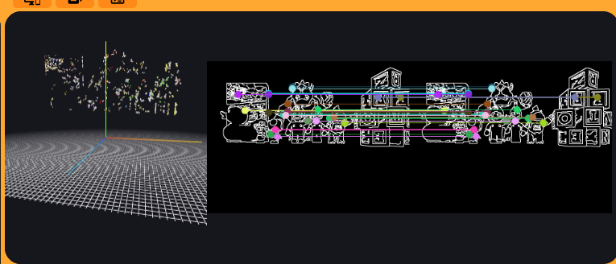
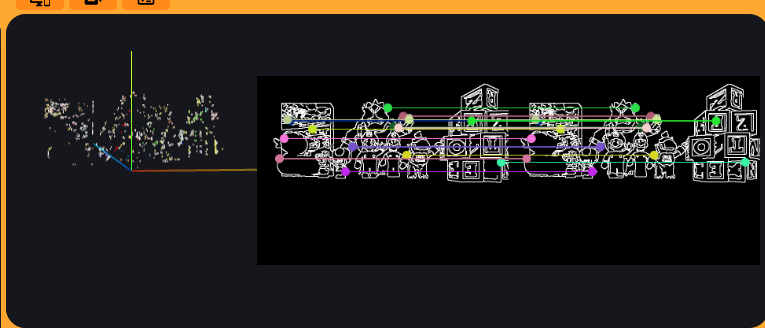
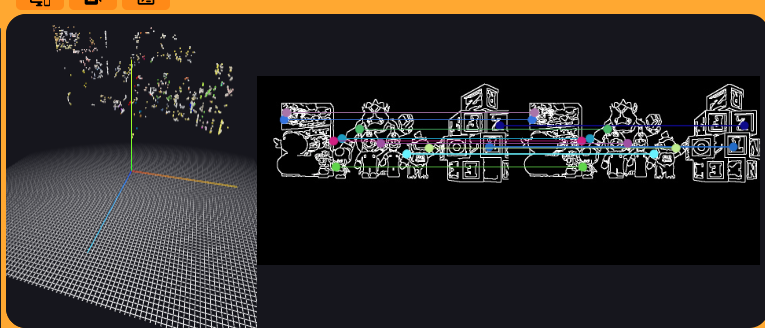

# 📦 Práctica 2: Reconstrucción 3D

---

## 👨‍💻 Autor

**Taref Bilel**
**Máster en Visión Artificial**
**Asignatura:** Visión Robótica

---

## 📌 Introducción

En esta práctica he trabajado con un sistema de reconstrucción 3D usando visión estéreo dentro de RoboticsAcademy / Unibotics.

La idea principal fue reconstruir una escena en 3D usando dos cámaras, una cámara izquierda y una cámara derecha.

Esto es parecido a cómo vemos los humanos. Nosotros tenemos dos ojos. Cada ojo ve la escena desde una posición un poco diferente. Nuestro cerebro usa esa diferencia para entender la profundidad, es decir, para saber si un objeto está cerca o lejos.

En esta práctica hice algo parecido, pero con el robot.

El robot tiene dos imágenes:

* Una imagen de la cámara izquierda.
* Una imagen de la cámara derecha.

Yo usé esas dos imágenes para buscar puntos comunes entre ellas. Después, con esos puntos, calculé su posición en el espacio 3D.

El resultado final fue una nube de puntos 3D. Esta nube de puntos representa partes de la escena, como objetos, bloques y estructuras.

---

## 🎯 Objetivo

El objetivo de esta práctica fue crear un sistema capaz de reconstruir una escena en 3D usando dos imágenes estéreo.

Para conseguirlo, yo hice varias cosas paso a paso:

* Primero, obtuve las imágenes de la cámara izquierda y derecha.
* Después, preparé las imágenes para poder trabajar mejor con ellas.
* Luego, detecté bordes en las imágenes.
* Después, usé esos bordes como puntos importantes.
* Luego, busqué correspondencias entre la imagen izquierda y la imagen derecha.
* Después, apliqué la restricción epipolar para buscar mejor los puntos.
* Luego, calculé la posición 3D usando triangulación.
* Finalmente, mostré los puntos 3D usando WebGUI.

Mi objetivo no era obtener una reconstrucción perfecta, sino conseguir una reconstrucción estable, coherente y reconocible en tiempo real.

---

# 🧠 Idea principal de la reconstrucción 3D

La idea de esta práctica se puede explicar de forma sencilla.

Imaginemos que tengo dos fotos del mismo objeto, pero tomadas desde posiciones un poco diferentes.

En la foto izquierda, un punto del objeto aparece en una posición.
En la foto derecha, el mismo punto aparece en otra posición un poco diferente.

Esa diferencia entre las dos posiciones se llama disparidad.

Si la diferencia es grande, normalmente el objeto está más cerca.
Si la diferencia es pequeña, normalmente el objeto está más lejos.

Entonces, yo usé esta idea:

**comparar la imagen izquierda con la imagen derecha para calcular la profundidad.**

Después, con la profundidad, pude obtener puntos en 3D.

En resumen:

**dos imágenes 2D → comparación entre ellas → cálculo de profundidad → puntos 3D**

---

# 🔁 Pipeline general

El sistema que implementé sigue este flujo:

```text
Imágenes estéreo
   ↓
Preprocesamiento
   ↓
Detección de bordes
   ↓
Selección de puntos
   ↓
Búsqueda de correspondencias
   ↓
Restricción epipolar
   ↓
Triangulación
   ↓
Visualización 3D
```

Explicado de forma simple:

1. Primero, el robot mira con dos cámaras.
2. Después, yo limpio un poco las imágenes.
3. Luego, detecto los bordes de los objetos.
4. Después, busco el mismo punto en las dos imágenes.
5. Luego, calculo dónde está ese punto en el espacio.
6. Finalmente, dibujo todos los puntos en 3D.

---

# ⚙️ Metodología

En esta sección explico paso a paso lo que hice.

---

## 1. Adquisición de imágenes

Lo primero que hice fue obtener las dos imágenes del simulador.

Usé la cámara izquierda y la cámara derecha.

La imagen izquierda representa lo que ve la cámara izquierda.
La imagen derecha representa lo que ve la cámara derecha.

Estas dos imágenes son muy parecidas, pero no son exactamente iguales, porque las cámaras están separadas por una pequeña distancia.

Esa pequeña diferencia es lo que permite calcular la profundidad.

Es como cuando miramos un objeto con un ojo y luego con el otro. El objeto parece moverse un poco. Esa diferencia ayuda a saber si está cerca o lejos.

---

## 2. Preprocesamiento de las imágenes

Después de obtener las imágenes, yo no trabajé directamente con las imágenes originales.

Primero las preparé.

Esto se llama preprocesamiento.

Hice el preprocesamiento porque las imágenes originales pueden tener ruido, colores, sombras o detalles que no ayudan mucho a encontrar puntos correctos.

Entonces, antes de buscar correspondencias, preparé las imágenes para que fuera más fácil detectar zonas importantes.

El preprocesamiento que hice tuvo varios pasos:

* Convertí la imagen a escala de grises.
* Apliqué un filtro para reducir ruido.
* Detecté bordes con Canny.
* Hice los bordes un poco más visibles.

---

## 3. Conversión a escala de grises

Primero convertí las imágenes a escala de grises.

Esto significa que quité la información de color y dejé solo la información de intensidad.

Lo hice porque para detectar bordes no necesito todos los colores. Muchas veces es suficiente saber dónde hay cambios fuertes de intensidad.

Por ejemplo, si un objeto oscuro está sobre un fondo claro, ahí aparece un borde.

Trabajar en gris también hace el proceso más simple y más rápido.

---

## 4. Reducción de ruido

Después apliqué un filtro para reducir el ruido de la imagen.

El ruido son pequeños cambios o puntos extraños que pueden aparecer en la imagen y que no representan objetos reales.

Si no reduzco el ruido, el detector de bordes puede encontrar muchos bordes falsos.

Entonces, yo apliqué un filtro bilateral.

Este filtro ayuda a suavizar la imagen, pero intenta mantener los bordes importantes.

Esto es útil porque quiero quitar ruido, pero no quiero borrar las formas de los objetos.

---

## 5. Detección de bordes

Después detecté los bordes usando Canny.

Los bordes son zonas donde la imagen cambia mucho.

Por ejemplo:

* El borde de un bloque.
* El borde de un personaje.
* El borde de una pared.
* El borde de un objeto.

Yo usé los bordes porque son puntos muy útiles para comparar la imagen izquierda y la imagen derecha.

En vez de usar todos los píxeles de la imagen, me concentré en los bordes.

Esto ayuda porque los bordes representan partes importantes de la escena.

---

## 6. Dilatación de bordes

Después de detectar los bordes, los hice un poco más gruesos usando dilatación.

Esto lo hice porque a veces los bordes detectados son muy finos o están cortados.

Si los bordes son demasiado finos, puede ser más difícil encontrar correspondencias entre las dos imágenes.

Con la dilatación, los bordes se vuelven un poco más visibles y más fáciles de usar.

No significa que cambio la escena, solo hago que los puntos importantes sean más claros para el algoritmo.

---

# 🔍 Detección de puntos importantes

Después del preprocesamiento, usé los píxeles de borde como puntos importantes.

En esta práctica no usé detectores como SIFT u ORB.

Yo decidí usar los bordes porque quería tener muchos puntos para reconstruir la escena.

Los bordes aparecen en muchos lugares de la imagen, por ejemplo en objetos, esquinas y cambios de forma.

Esto me permitió tener más puntos para crear la nube 3D.

---

## ¿Por qué usé bordes?

Usé bordes por varias razones:

* Los bordes son fáciles de detectar.
* Hay muchos bordes en la escena.
* Los bordes cubren muchas partes de los objetos.
* Ayudan a crear una nube de puntos más visible.
* Son más rápidos de obtener que otros métodos más complejos.

La idea era simple:

**si un píxel pertenece a un borde, lo considero un punto candidato para reconstrucción.**

Pero no todos los puntos son buenos. Por eso, después tuve que filtrar y comprobar las correspondencias.

---

# 🔁 Búsqueda de correspondencias estéreo

Después de seleccionar puntos en la imagen izquierda, tuve que buscar dónde aparece el mismo punto en la imagen derecha.

Esta parte es muy importante.

Para reconstruir un punto en 3D, necesito saber:

* Dónde está el punto en la imagen izquierda.
* Dónde está el mismo punto en la imagen derecha.

Si encuentro mal el punto en la derecha, la reconstrucción 3D será incorrecta.

Por eso, la búsqueda de correspondencias tiene que ser lo más estable posible.

---

## Explicación simple de la correspondencia

Imaginemos que en la imagen izquierda veo la esquina de un bloque.

Ahora tengo que buscar esa misma esquina en la imagen derecha.

Pero no puedo buscar cualquier punto al azar. Tengo que buscar un punto que se parezca mucho.

Para hacer esto, yo usé pequeños parches de imagen.

Un parche es como un cuadradito pequeño alrededor del punto.

Entonces hice esto:

1. Tomo un punto de la imagen izquierda.
2. Tomo un pequeño cuadrado alrededor de ese punto.
3. Busco un cuadrado parecido en la imagen derecha.
4. Si encuentro uno muy parecido, considero que son el mismo punto.
5. Si no es suficientemente parecido, rechazo ese punto.

---

## Búsqueda sobre la línea epipolar

Para hacer la búsqueda más fácil y más estable, usé la restricción epipolar.

En esta práctica, las imágenes están rectificadas. Esto significa que el punto correspondiente en la imagen derecha debe estar en la misma fila que el punto de la imagen izquierda.

Entonces, si un punto está en una fila concreta de la imagen izquierda, yo busco su correspondencia solo en esa misma fila en la imagen derecha.

Esto reduce muchísimo los errores.

En vez de buscar en toda la imagen, busco solo en una línea.

Es como si alguien me dijera:

**“No busques el objeto en toda la habitación, busca solo en esta fila.”**

Esto hace que el algoritmo sea más rápido y más preciso.

---

# 🔒 Filtros para evitar errores

Durante la práctica, me di cuenta de que no todas las correspondencias eran buenas.

A veces, el algoritmo podía encontrar un punto parecido, pero no era realmente el mismo punto.

Si uso muchos puntos incorrectos, la nube 3D se llena de ruido y puntos flotantes.

Por eso añadí varios filtros.

---

## 1. Filtro por puntuación mínima

Primero añadí una puntuación mínima.

Cuando comparo dos parches, obtengo una puntuación que indica si se parecen mucho o poco.

Si la puntuación es alta, significa que los parches se parecen bastante.

Si la puntuación es baja, significa que la correspondencia no es fiable.

Entonces, yo rechacé las correspondencias con puntuación baja.

Usé este valor:

```text
min_score = 0.50
```

Esto significa que si la coincidencia no es suficientemente buena, no la uso.

---

## 2. Rechazo por ambigüedad

También añadí un filtro para rechazar correspondencias ambiguas.

Una correspondencia ambigua ocurre cuando hay dos posibles puntos muy parecidos.

Por ejemplo, imagina que busco una esquina y encuentro dos zonas casi iguales en la imagen derecha.

En ese caso, el algoritmo no está seguro.

Si la mejor opción y la segunda mejor opción son muy parecidas, prefiero rechazar ese punto.

Esto mejora la estabilidad porque es mejor usar menos puntos, pero más seguros.

Para esto usé:

```text
ambiguity_margin = 0.10
```

La idea fue:

**si no estoy seguro de cuál es el punto correcto, no lo uso.**

---

## 3. Restricción epipolar estricta

También usé una restricción epipolar estricta.

Usé:

```text
row_tolerance = 0
```

Esto significa que busqué la correspondencia exactamente en la misma fila.

No permití buscar una fila arriba o una fila abajo.

Esto hizo que el sistema fuera más estable, porque reduje mucho las correspondencias incorrectas.

---

## 4. Límites de disparidad

También puse límites para la disparidad.

La disparidad es la diferencia horizontal entre la posición del punto en la imagen izquierda y en la imagen derecha.

No cualquier valor de disparidad tiene sentido.

Por eso usé:

```text
min_disparity = 2
max_disparity = 120
```

Con esto evité correspondencias imposibles o demasiado extrañas.

Si la disparidad era demasiado pequeña o demasiado grande, rechazaba el punto.

Esto ayudó a quitar muchos errores.

---

# 📐 Triangulación

Después de encontrar una correspondencia entre la imagen izquierda y la imagen derecha, el siguiente paso fue calcular el punto 3D.

Esto se llama triangulación.

La triangulación usa geometría.

La idea es que desde cada cámara sale un rayo hacia el punto observado.

Entonces tengo:

* Un rayo que sale de la cámara izquierda.
* Un rayo que sale de la cámara derecha.

Si esos dos rayos apuntan al mismo objeto, se cruzan o pasan muy cerca uno del otro.

El punto 3D está cerca del lugar donde esos rayos se encuentran.

---

## Explicación con ejemplo simple

Imagina que dos personas están mirando el mismo objeto desde dos lugares diferentes.

Cada persona señala el objeto con el dedo.

Si dibujamos una línea desde cada persona hacia donde señala, las dos líneas se cruzan en el objeto.

Eso es básicamente la triangulación.

En esta práctica, las dos personas son las dos cámaras.

Y el objeto es el punto que quiero reconstruir en 3D.

---

## Uso de las funciones geométricas

Para hacer la triangulación, usé las funciones geométricas de HAL.

Estas funciones me ayudan a pasar de coordenadas de imagen a rayos en el espacio.

Primero, convierto el punto de la imagen al sistema correcto.

Después, genero un rayo desde la cámara.

Luego, uso la posición de las cámaras para calcular dónde se encuentra el punto 3D.

De forma simple:

**punto en imagen izquierda + punto en imagen derecha → punto en 3D**

---

# 🧮 Validación geométrica

Después de calcular la triangulación, añadí una validación geométrica.

Esto fue necesario porque a veces los dos rayos no se cruzan bien.

Si la correspondencia es mala, los rayos pueden quedar muy separados.

Entonces, yo calculé la distancia entre los rayos.

Si la distancia era muy grande, rechazaba ese punto.

Usé este valor:

```text
max_ray_distance = 15.0
```

Esto significa que si los rayos estaban demasiado separados, el punto no era fiable.

Este filtro ayudó mucho a eliminar puntos flotantes y errores grandes en la nube 3D.

---

## Punto 3D final

Cuando la triangulación era válida, calculé el punto 3D final.

Como los rayos no siempre se cruzan exactamente, usé un punto intermedio entre ellos.

Este punto intermedio representa la mejor estimación del punto real.

Después añadí ese punto a la nube de puntos.

Cada punto 3D tenía:

* Coordenada `x`
* Coordenada `y`
* Coordenada `z`
* Color rojo `r`
* Color verde `g`
* Color azul `b`

Así pude visualizar la nube con información de color.

---

# 🌐 Visualización 3D

Después de calcular muchos puntos 3D, los mostré usando WebGUI.

La visualización es importante porque permite ver si la reconstrucción tiene sentido.

Si los puntos aparecen totalmente desordenados, significa que hay muchos errores.

Si los puntos forman una estructura reconocible, significa que el sistema está funcionando mejor.

En mi caso, pude ver una nube de puntos que representaba partes de la escena.

No era una reconstrucción perfecta, pero sí era reconocible.

---

# ⚙️ Parámetros finales

Después de hacer varias pruebas, elegí una configuración final.

Los parámetros que usé fueron:

```text
feature_step = 3
patch_size = 9
max_points = 900

min_score = 0.50
ambiguity_margin = 0.10

min_disparity = 2
max_disparity = 120
row_tolerance = 0

max_ray_distance = 15.0
```

Estos parámetros fueron importantes porque controlan el comportamiento del sistema.

---

## Explicación simple de los parámetros

`feature_step = 3` significa que no uso todos los píxeles, sino que salto algunos para reducir el coste.

`patch_size = 9` significa que comparo cuadrados pequeños de tamaño 9 alrededor de cada punto.

`max_points = 900` significa que limito el número máximo de puntos para que el sistema pueda funcionar en tiempo real.

`min_score = 0.50` significa que solo acepto correspondencias con una similitud mínima.

`ambiguity_margin = 0.10` significa que rechazo puntos cuando hay demasiada duda entre dos posibles correspondencias.

`min_disparity = 2` y `max_disparity = 120` limitan las diferencias posibles entre las dos imágenes.

`row_tolerance = 0` significa que busco correspondencias solo en la misma fila.

`max_ray_distance = 15.0` significa que rechazo triangulaciones donde los rayos están demasiado separados.

---

# 📊 Resultados

El sistema final consiguió generar una nube de puntos 3D reconocible.

La reconstrucción no era perfecta, porque este problema es difícil y depende mucho de las correspondencias entre las dos imágenes.

Pero el resultado fue positivo porque se podían reconocer partes importantes de la escena.

En la nube de puntos se podían observar elementos como:

* El pato.
* Personajes de Mario.
* Bloques.
* Partes de la estructura.
* La profundidad de la escena.

La nube no era completamente densa, pero sí era coherente.

Esto significa que los puntos no estaban totalmente aleatorios, sino que formaban una estructura con sentido.

---

## 🖼️ Ejemplos de reconstrucción

---

### 🔹 Resultado de reconstrucción 1

El primer resultado muestra una reconstrucción con muchos puntos detectados.

En esta prueba, el sistema encontró bastantes correspondencias entre la imagen izquierda y la imagen derecha.

Esto ayudó a tener una nube más densa, es decir, con más puntos.

Pero también se podía generar algo de ruido, porque cuando uso muchos puntos, también pueden aparecer más correspondencias incorrectas.



---

### 🔹 Resultado de reconstrucción 2

En el segundo resultado, ajusté mejor algunos filtros para mejorar la estabilidad geométrica.

Con esta configuración, la nube de puntos fue más limpia.

Se redujeron algunas correspondencias incorrectas y la reconstrucción empezó a tener una forma más coherente.



---

### 🔹 Resultado de reconstrucción 3

El tercer resultado corresponde a la configuración final ajustada.

En esta versión, la reconstrucción fue más estable.

La restricción epipolar, el filtro de ambigüedad y la validación geométrica ayudaron a obtener una nube de puntos más limpia.

Este fue el resultado que consideré mejor porque tenía un buen equilibrio entre cantidad de puntos y calidad de reconstrucción.



---

# 📌 Observaciones

Durante la práctica hice varias observaciones importantes.

Primero, vi que buscar la correspondencia en la misma fila mejoraba mucho el resultado.

Esto tiene sentido porque en imágenes estéreo rectificadas, el punto correspondiente debe estar en la misma línea horizontal.

También observé que el filtro de ambigüedad era muy útil.

Cuando dos puntos eran muy parecidos, era mejor rechazar la correspondencia antes que aceptar una mala.

Otra cosa importante fue la validación de la distancia entre rayos.

Este filtro eliminó muchos puntos flotantes que aparecían en posiciones incorrectas.

También observé que aumentar el número de puntos hacía la nube más densa, pero también podía aumentar el ruido.

Por eso fue necesario ajustar los parámetros con cuidado.

---

# ⚖️ Equilibrio entre densidad y estabilidad

Una parte importante de esta práctica fue encontrar un equilibrio.

Si uso pocos puntos, la nube es más limpia, pero tiene poca información.

Si uso muchos puntos, la nube tiene más detalles, pero también puede tener más ruido.

Entonces, yo tuve que probar varios parámetros hasta encontrar una configuración aceptable.

El objetivo fue conseguir una nube que fuera:

* Suficientemente densa.
* Suficientemente limpia.
* Estable.
* Reconocible.
* Capaz de funcionar en tiempo real.

---

# 🚀 Tecnologías utilizadas

En esta práctica utilicé varias herramientas:

* Python
* OpenCV
* NumPy
* HAL API
* WebGUI
* RoboticsAcademy / Unibotics

Python fue el lenguaje principal.

OpenCV me sirvió para procesar las imágenes, convertirlas a gris, filtrar ruido y detectar bordes.

NumPy me ayudó a trabajar con matrices y cálculos numéricos.

HAL API me permitió obtener las imágenes de las cámaras y usar funciones geométricas.

WebGUI me permitió mostrar la nube de puntos 3D.

RoboticsAcademy / Unibotics fue el entorno donde probé la práctica.

---

# 📊 Resumen de lo que hice

En resumen, en esta práctica hice lo siguiente:

1. Primero obtuve las imágenes de la cámara izquierda y derecha.
2. Después convertí las imágenes a escala de grises.
3. Luego apliqué un filtro para reducir ruido.
4. Después detecté bordes con Canny.
5. Luego hice los bordes un poco más visibles con dilatación.
6. Después usé los bordes como puntos importantes.
7. Luego busqué correspondencias entre la imagen izquierda y derecha.
8. Después limité la búsqueda a la misma línea epipolar.
9. Luego rechacé correspondencias con baja puntuación.
10. Después rechacé correspondencias ambiguas.
11. Luego apliqué límites de disparidad.
12. Después calculé rayos desde las dos cámaras.
13. Luego hice triangulación para obtener puntos 3D.
14. Después validé la distancia entre los rayos.
15. Luego añadí los puntos válidos a la nube 3D.
16. Finalmente mostré la reconstrucción usando WebGUI.

---

# ✅ Conclusiones

En esta práctica conseguí implementar un sistema completo de reconstrucción 3D usando visión estéreo.

Primero trabajé con dos imágenes, una de la cámara izquierda y otra de la cámara derecha.

Después preparé las imágenes para detectar mejor los bordes.

Luego usé esos bordes como puntos importantes para buscar correspondencias.

La parte más importante fue encontrar el mismo punto en las dos imágenes. Para hacerlo más estable, usé la restricción epipolar y varios filtros.

Después, con las correspondencias válidas, hice triangulación para calcular los puntos en 3D.

Finalmente, visualicé la nube de puntos usando WebGUI.

El resultado no fue perfecto, pero sí fue coherente y reconocible.

Esta práctica me ayudó a entender mejor cómo una máquina puede obtener información de profundidad usando dos cámaras, igual que los humanos usamos dos ojos para entender el espacio.

---

# 🧠 Explicación simple de todo el trabajo

De forma muy sencilla, yo hice que el robot mirara la escena con dos cámaras.

Primero, el robot tomó una imagen con la cámara izquierda y otra con la cámara derecha.

Después, yo preparé esas imágenes para encontrar los bordes de los objetos.

Luego, busqué puntos que aparecían en las dos imágenes.

Cuando encontraba el mismo punto en las dos imágenes, podía calcular si ese punto estaba cerca o lejos.

Después, usé geometría para colocar ese punto en el espacio 3D.

Repetí este proceso muchas veces con muchos puntos.

Al final, todos esos puntos juntos formaron una nube de puntos 3D.

Es como construir una maqueta de la escena usando muchos puntitos.

El ciclo fue:

```text
mirar con dos cámaras → detectar bordes → buscar puntos iguales → calcular profundidad → crear puntos 3D → mostrar la nube
```

En resumen, yo no reconstruí la escena usando magia. Lo hice comparando dos imágenes y usando geometría para calcular dónde están los objetos en el espacio.

## 🎥 Video de demostración

En este video se puede ver el resultado de la reconstrucción 3D dentro del simulador.

https://drive.google.com/file/d/1u_G3QgKU1zmJcjxR8cgEtO9oRaLX5rmj/view?usp=sharing
