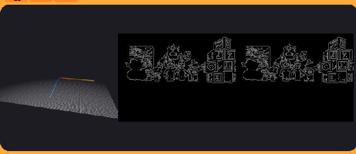
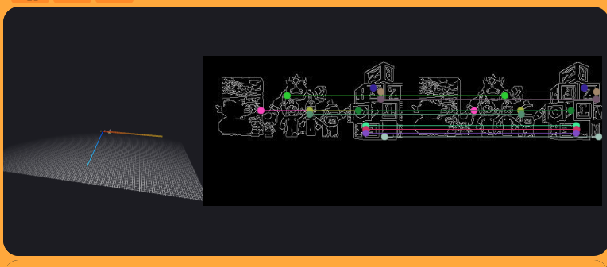
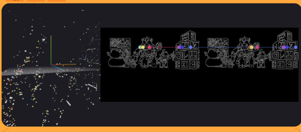
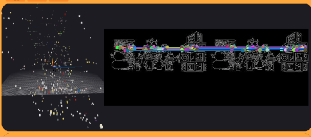

# 📦 Practice 2: 3D Reconstruction

---

## 👨‍💻 Author

**Taref Bilel**
**Master en Visión Artificial**
**Asignatura:** Visión Robótica

---

## 📘 Introduction

Understanding the 3D structure of the environment is a key capability in robotics and computer vision.
Stereo vision allows us to estimate depth by using two images captured from different viewpoints.

In this practice, we implement a **3D reconstruction pipeline** based on stereo vision. The system detects features, matches them between two images, and computes their 3D position using triangulation.

This type of approach is widely used in:

* Autonomous driving
* Robot navigation
* 3D mapping
* Augmented reality

---

## 🎯 Objective

The objective of this practice is to design and implement a system that:

* Detects relevant features from stereo images
* Matches corresponding points between left and right views
* Computes their 3D coordinates using triangulation
* Visualizes the reconstructed scene as a point cloud

---

## ⚙️ Methodology

### 1. Image Acquisition

The system continuously captures images from two cameras:

```python
imgL = HAL.getImage('left')
imgR = HAL.getImage('right')
```

These images represent the same scene from different perspectives.

---

### 2. Preprocessing and Edge Detection

Each image is converted to grayscale and smoothed with a Gaussian filter.
Then, edge detection is applied using the Canny algorithm.

```python
gray = cv2.cvtColor(image, cv2.COLOR_BGR2GRAY)
edges = cv2.Canny(blur, 30, 100)
```

This step extracts structural features of the scene.

---

### 3. Feature Detection

Feature points are selected from edge pixels using a regular sampling strategy.

```python
if edges[y, x] > 0:
    pts.append((x, y))
```

Only edge points are used, reducing noise and improving relevance.

---

### 4. Stereo Matching

For each feature point in the left image:

* A patch is extracted around the point
* A search is performed in the right image along nearby rows
* Candidate points are evaluated using normalized cross-correlation

```python
score = cv2.matchTemplate(patchR, patchL, cv2.TM_CCOEFF_NORMED)
```

To improve reliability:

* A minimum score threshold is applied
* Ambiguous matches are rejected
* Only valid disparities are accepted

---

### 5. Triangulation

Once corresponding points are found, their 3D coordinates are computed using stereo projection matrices:

```python
X = cv2.triangulatePoints(self.P_left, self.P_right, ptsL, ptsR)
```

This converts 2D pixel correspondences into 3D points.

---

### 6. Point Cloud Processing

The resulting 3D points are refined:

* Outliers are removed using percentile filtering
* The point cloud is centered
* Scaling is applied for better visualization
* Coordinates are adjusted to match the viewer

---

### 7. Visualization

The final 3D points are displayed using the simulation interface:

```python
WebGUI.ShowAllPoints(points)
```

Each point keeps its original color from the image.

---

### 🖼️ Results

The following images show the different stages of the 3D reconstruction process.

---

### 🧩 Edge Detection

<p align="center">
  
</p>

Edges highlight the structure of the scene and allow feature extraction.

---

### 🔗 Feature Matching

<p align="center">
  
</p>

Correspondences between left and right images are computed using patch correlation.

---

### 🌐 Raw 3D Reconstruction

<p align="center">
  
</p>

The initial point cloud contains noise due to incorrect matches.

---

### ✅ Final 3D Reconstruction

<p align="center">
  
</p>

After filtering and scaling, the point cloud better represents the scene structure.

## 📊 Performance Summary

* ✔ Effective edge-based feature detection
* ✔ Successful stereo matching using correlation
* ✔ Generation of a 3D point cloud
* ✔ Real-time visualization

However:

* ⚠ Some incorrect matches introduce noise
* ⚠ Reconstruction remains sparse
* ⚠ Accuracy depends on edge quality

---


---

## ✅ Conclusion

This practice demonstrates the complete pipeline of stereo 3D reconstruction.

From raw images, the system detects features, matches them, and reconstructs a 3D representation of the scene.

Although the reconstruction is not perfect, it successfully captures the spatial structure and provides a solid foundation for more advanced computer vision techniques.

---
