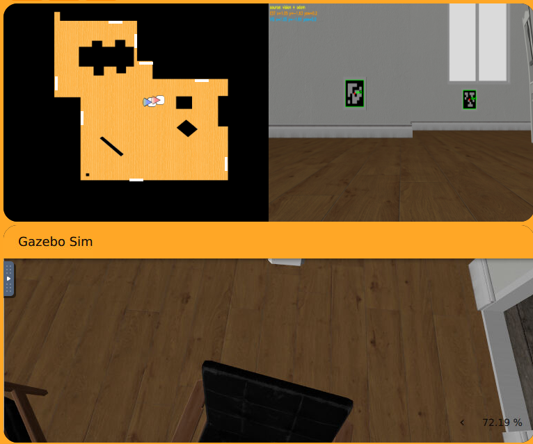
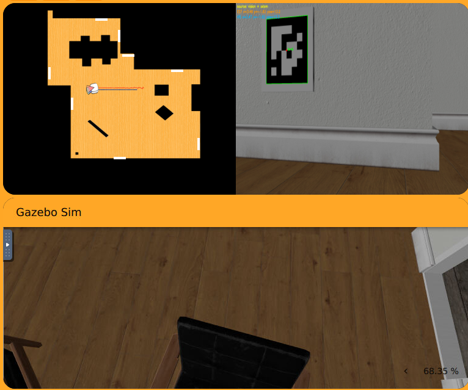
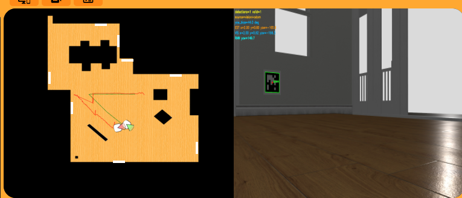
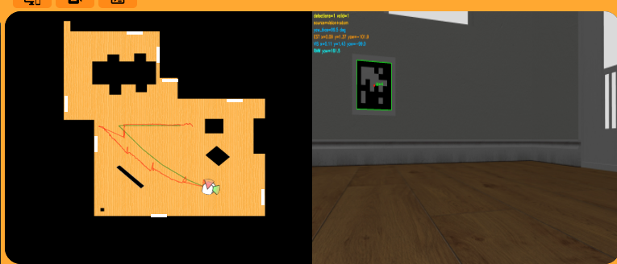
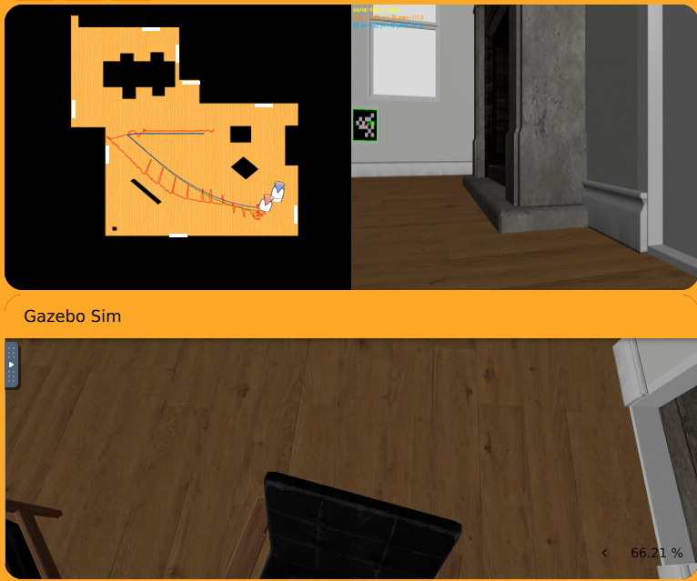

# 📍 Práctica 3: Localización Visual

---

## 👨‍💻 Autor

**Taref Bilel**
**Máster en Visión Artificial**
**Asignatura:** Visión Robótica

---

## 🤖 Localización visual con marcadores AprilTags

En esta práctica he trabajado con un sistema de localización visual usando AprilTags dentro de RoboticsAcademy / Unibotics.

La idea principal fue hacer que el robot pudiera saber dónde está dentro del mapa usando su cámara.

Para eso usé unos marcadores visuales llamados **AprilTags**. Estos marcadores son como pequeños carteles cuadrados que el robot puede ver con la cámara.

Cada AprilTag tiene una posición conocida dentro del mapa. Entonces, cuando el robot ve uno de estos marcadores, puede usar esa información para calcular su propia posición.

El objetivo fue estimar la pose del robot en 2D:

```text
pose = (x, y, yaw)
```

Esto significa:

* `x`: posición del robot en el mapa.
* `y`: posición del robot en el mapa.
* `yaw`: orientación del robot, es decir, hacia dónde está mirando.

En el simulador aparecen varios robots o posiciones:

* 🟢 El robot verde representa la posición real del robot.
* 🔵 El robot azul representa la odometría, que puede tener error.
* 🔴 El robot rojo representa la posición estimada por mi sistema.

Mi objetivo fue hacer que el robot rojo estuviera lo más cerca posible del robot verde.

---

# 📌 Idea general del proyecto

La idea de esta práctica fue bastante sencilla de entender.

Yo hice que el robot mirara el entorno con su cámara. Cuando el robot veía un AprilTag, mi programa detectaba ese marcador y calculaba dónde estaba el robot.

Es como si el robot dijera:

**“Veo este marcador en la pared. Como sé dónde está este marcador en el mapa, puedo calcular dónde estoy yo.”**

Entonces, el sistema funciona así:

1. El robot mira con la cámara.
2. Mi programa busca AprilTags en la imagen.
3. Si encuentra un AprilTag, calcula su posición respecto a la cámara.
4. Después usa la posición conocida del AprilTag en el mapa.
5. Finalmente calcula la posición estimada del robot.
6. Esa posición se muestra como el robot rojo en WebGUI.

---

# 🎯 Objetivo

El objetivo de esta práctica fue crear un sistema de localización visual para un robot móvil.

Yo quería que el robot pudiera moverse por el entorno y estimar su posición usando la cámara y los AprilTags.

Para conseguirlo, hice varias cosas:

* Primero, usé la cámara del robot para obtener imágenes.
* Después, busqué AprilTags dentro de esas imágenes.
* Luego, comprobé si los tags detectados eran válidos.
* Después, calculé la pose del tag respecto a la cámara.
* Luego, usé la posición conocida del tag para calcular la posición del robot.
* También combiné esta información con la odometría.
* Añadí suavizado para que el robot rojo no saltara mucho.
* Añadí filtros para rechazar detecciones malas.
* Finalmente, mostré el resultado en WebGUI.

Mi objetivo no era solo detectar el marcador. Lo importante era usar ese marcador para saber dónde estaba el robot.

---

# 🧠 Explicación simple de la localización

La localización significa saber dónde está el robot.

Para explicarlo fácil, imagina que estás en una habitación y ves una señal en una pared.

Si tú sabes dónde está esa señal, puedes imaginar dónde estás tú.

Por ejemplo:

* Si ves la señal muy cerca, estás cerca de ella.
* Si la ves lejos, estás más lejos.
* Si la ves a la derecha, sabes que tienes que girar un poco.
* Si la ves centrada, sabes que estás mirando hacia ella.

Con los AprilTags pasa algo parecido.

El robot ve un marcador y usa ese marcador como una referencia.

Entonces, los AprilTags son como “puntos conocidos” dentro del mapa.

---

# 🔁 Flujo general del sistema

El sistema que hice sigue este flujo:

```text
Imagen de la cámara
    ↓
Detección de AprilTags
    ↓
Cálculo de la pose con geometría
    ↓
Cálculo de la posición del robot
    ↓
Corrección con odometría
    ↓
Visualización en WebGUI
```

Explicado de forma más simple:

1. Primero, el robot mira con la cámara.
2. Después, mi programa busca los marcadores.
3. Si encuentra un marcador, calcula dónde está.
4. Luego calcula dónde está el robot.
5. Después corrige la estimación usando la odometría.
6. Finalmente muestra la posición estimada como robot rojo.

---

# 🏷️ Detección de AprilTags

Para detectar los marcadores, usé la librería `pyapriltags`.

Esta librería permite encontrar AprilTags dentro de una imagen.

Cuando el robot ve un marcador, el detector puede obtener información como:

* El ID del marcador.
* Las esquinas del marcador.
* El centro del marcador.
* El tamaño del marcador en la imagen.

Esto es importante porque con las esquinas puedo calcular la posición del marcador respecto a la cámara.

Yo acepté solo los AprilTags que tenían sentido. Por ejemplo, si un marcador se veía demasiado pequeño o la detección no era fiable, prefería no usarlo.

Esto ayuda a evitar errores.

---

# 📷 Modelo de cámara

También usé un modelo simple de cámara.

La cámara no solo da una imagen. También tiene parámetros que ayudan a entender cómo se forma esa imagen.

La idea simple es que el modelo de cámara ayuda a transformar lo que veo en la imagen en información geométrica.

Sin este modelo sería difícil calcular si el marcador está cerca, lejos, a la izquierda o a la derecha.

---

# 📐 Estimación de pose con PnP

Después de detectar un AprilTag, usé un método llamado PnP.

No hace falta explicarlo con fórmulas complicadas.

La idea es esta:

* Yo sé que el AprilTag es un cuadrado.
* Yo sé su tamaño real.
* La cámara ve ese cuadrado en la imagen.
* Entonces puedo calcular desde dónde lo está viendo la cámara.

Es como mirar una hoja cuadrada en una foto. Si sé el tamaño real de la hoja y veo cómo aparece en la imagen, puedo estimar la posición de la cámara respecto a esa hoja.

En esta práctica hice eso con los AprilTags.

---

# 🌍 Del marcador a la posición del robot

Cuando ya sabía dónde estaba el marcador respecto a la cámara, el siguiente paso fue calcular dónde estaba el robot en el mapa.

El razonamiento que hice fue:

1. Sé dónde está el AprilTag en el mapa.
2. Calculo dónde está la cámara respecto al AprilTag.
3. Entonces puedo calcular dónde está la cámara en el mundo.
4. Como la cámara está montada en el robot, puedo estimar dónde está el robot.

Al final obtengo:

```text
x, y, yaw
```

Esos valores son la posición y orientación estimada del robot.

---

# 🔁 Odometría y corrección visual

En esta práctica no usé solo la visión.

También usé la odometría.

La odometría estima el movimiento del robot, pero puede tener error. Por ejemplo, si el robot avanza, la odometría calcula que el robot se ha movido. Pero con el tiempo puede equivocarse un poco.

Por eso yo combiné dos cosas:

* La visión con AprilTags.
* La odometría del robot.

Cuando el robot ve un AprilTag, uso la visión para corregir la posición.

Cuando el robot no ve ningún AprilTag, uso la odometría para seguir estimando el movimiento.

Esto es importante porque si el robot pierde un marcador durante un momento, la posición estimada no se queda parada.

---

# 🧭 Orientación del robot

También tuve que trabajar con la orientación del robot, que se llama `yaw`.

El `yaw` indica hacia dónde está mirando el robot.

Esta parte fue importante porque la cámara, OpenCV, Gazebo y el robot pueden usar sistemas de coordenadas diferentes.

Si no se ajusta bien esta orientación, el robot rojo puede aparecer girado de forma incorrecta.

Por eso añadí correcciones para que la orientación del robot estimado fuera más coherente con el movimiento real.

---

# 🧪 Mejoras para que el sistema sea más estable

Durante la práctica añadí varias mejoras para que la localización fuera más estable.

Esto fue necesario porque la detección visual puede fallar a veces.

Por ejemplo:

* El AprilTag puede estar lejos.
* El AprilTag puede verse pequeño.
* El AprilTag puede verse de lado.
* El robot puede perder el marcador.
* La pose puede saltar de golpe.
* La odometría puede acumular error.

Para mejorar esto hice varias cosas.

---

## 1. Filtro por tamaño del AprilTag

Primero, comprobé el tamaño del marcador en la imagen.

Si el AprilTag se veía demasiado pequeño, no confiaba mucho en esa detección.

Esto es porque un marcador pequeño puede dar una estimación menos precisa.

Entonces, preferí usar marcadores que se veían suficientemente grandes.

---

## 2. Validación de la pose

También comprobé que la pose calculada tuviera sentido.

Si el cálculo daba una posición rara o imposible, rechazaba ese resultado.

Esto ayudó a evitar que el robot rojo saltara a posiciones incorrectas.

---

## 3. Rechazo de saltos bruscos

También añadí un control para evitar saltos grandes.

A veces una mala detección puede hacer que la posición estimada cambie mucho de golpe.

Eso no es realista.

Entonces, si la nueva estimación estaba demasiado lejos de la anterior, no la aceptaba directamente.

Esto hizo que el robot rojo se moviera de forma más suave.

---

## 4. Suavizado de la pose

También usé suavizado.

El suavizado significa que no cambio la posición estimada de forma brusca.

En vez de pasar directamente de una posición a otra, mezclo un poco la posición anterior con la nueva.

Así el robot rojo se mueve de manera más estable y no salta demasiado.

---

## 5. Uso de varios AprilTags

Cuando el robot veía más de un AprilTag, podía usar más información.

Esto ayuda porque usar varios marcadores puede mejorar la estimación.

Si un marcador tiene un poco de error, otro marcador puede ayudar a corregir.

---

# 🚗 Movimiento del robot

También programé un comportamiento simple para el robot.

El robot hacía esto:

* Si veía un AprilTag, avanzaba despacio.
* Si no veía ningún AprilTag, giraba para buscar uno.
* Si estaba cerca de un obstáculo, intentaba evitarlo.
* Si el tag estaba a un lado de la imagen, el robot intentaba orientarse mejor.

Esto ayudó a que el robot pudiera moverse por el entorno y seguir detectando marcadores.

---

# 🖥️ Visualización y depuración

La visualización fue muy importante en esta práctica.

En la parte izquierda de las imágenes se ve el mapa desde arriba.

En ese mapa se pueden ver:

* La posición real.
* La posición estimada.
* La trayectoria del robot.
* Las líneas rojas que muestran el recorrido estimado.

En la parte derecha se ve la imagen de la cámara del robot.

Ahí se puede ver cómo el robot detecta los AprilTags en la pared. Los marcadores aparecen con un cuadro verde alrededor.

Esta visualización me ayudó mucho, porque pude ver si el robot estaba detectando bien los tags y si la posición roja seguía bien a la posición real.

---

# 📂 Estructura del proyecto

La estructura del proyecto fue sencilla:

```text
P3_TarefBilel/
└── code.py
```

Todo el código principal está dentro de `code.py`.

---

# ▶️ Cómo ejecutar la práctica

Para ejecutar la práctica, seguí estos pasos:

1. Abrí RoboticsAcademy / Unibotics.
2. Entré en la práctica de Marker Based Visual Localization.
3. Copié el contenido de `code.py`.
4. Lo pegué en el editor de la práctica.
5. Ejecuté la simulación.
6. Observé el robot rojo y el robot verde en WebGUI.

La idea era comprobar si el robot rojo seguía al robot verde.

---

# ⚙️ Parámetros principales

Los parámetros principales que usé controlan el tamaño del AprilTag, la velocidad del robot, la corrección visual y los límites para rechazar malas estimaciones.

Estos parámetros me ayudaron a conseguir un comportamiento más estable.

Por ejemplo:

* Usé un tamaño conocido para el AprilTag.
* Puse una velocidad lenta para que el robot no se moviera demasiado rápido.
* Añadí límites para evitar saltos visuales grandes.
* Añadí suavizado para que la estimación fuera menos brusca.
* Usé una frecuencia de ejecución estable para actualizar la pose en tiempo real.

---

# 📊 Resultados

Las siguientes imágenes muestran el comportamiento del sistema durante la localización.

En todas las imágenes, el objetivo es ver si la posición estimada se mantiene cerca de la posición real.

También se puede ver que el robot detecta los AprilTags en la imagen de la cámara, porque aparecen marcados con un rectángulo verde.

---

## ✅ Resultado 1 — Primera detección de AprilTags

En este primer resultado, el robot empieza viendo varios AprilTags en la pared.

En la cámara se pueden ver dos marcadores. Esto es bueno porque el sistema tiene referencias visuales para calcular la posición.

En el mapa de arriba a la izquierda, se ve que el robot estimado está cerca de la posición real.

En esta fase comprobé que:

* El detector encontraba los AprilTags correctamente.
* Los marcadores aparecían marcados en verde.
* La pose estimada empezaba cerca de la pose real.
* El sistema podía inicializar la localización.



---

## ✅ Resultado 2 — El robot se acerca al marcador

En este resultado, el robot se acerca mucho a un AprilTag.

El marcador aparece más grande en la cámara. Esto normalmente ayuda porque, cuando el tag se ve más grande, la estimación puede ser más fiable.

En el mapa, se ve una línea roja que indica la trayectoria estimada.

Aquí yo comprobé que:

* El robot seguía detectando el tag.
* La estimación visual se actualizaba.
* El robot rojo seguía cerca del robot real.
* El sistema funcionaba bien cuando el marcador estaba cerca.



---

## ✅ Resultado 3 — Movimiento y cambio de orientación

En este resultado, el robot ya se ha movido más por el entorno.

Se puede ver que el robot cambia su orientación y sigue navegando. En la cámara aparece un AprilTag más lejos y a un lado.

En el mapa, la trayectoria roja empieza a mostrar el camino que ha seguido el robot.

Aquí observé que:

* El robot podía seguir localizándose mientras se movía.
* La odometría ayudaba durante el movimiento.
* La visión corregía la estimación cuando veía un marcador.
* La trayectoria estimada tenía sentido dentro del mapa.



---

## ✅ Resultado 4 — Trayectoria más larga

En este resultado, el robot ha recorrido una zona más larga del mapa.

La línea roja muestra que la estimación ha ido siguiendo el movimiento del robot durante más tiempo.

En la cámara todavía se detecta un AprilTag en la pared, y eso permite corregir la pose.

Aquí comprobé que:

* El sistema no funcionaba solo al principio, sino durante una trayectoria más larga.
* El robot rojo seguía una trayectoria parecida a la real.
* Las correcciones visuales ayudaban a mantener la estimación estable.
* El robot podía seguir navegando mientras miraba los tags.



---

## ✅ Resultado 5 — Navegación cerca de paredes y obstáculos

En este último resultado, el robot está cerca de una zona con paredes y obstáculos.

Esto es más difícil porque los tags pueden verse más pequeños, más laterales o parcialmente.

Aun así, el sistema sigue detectando un AprilTag y mantiene una estimación razonable.

En el mapa se ve que la trayectoria roja continúa y que el robot estimado sigue moviéndose de forma coherente.

Aquí observé que:

* El sistema podía trabajar cerca de obstáculos.
* El robot seguía detectando marcadores en la pared.
* La trayectoria estimada seguía siendo coherente.
* La combinación de visión y odometría ayudaba a no perder completamente la localización.



---


---

# 📈 Observaciones finales

Durante la práctica observé varias cosas importantes.

Primero, vi que la detección de AprilTags era la parte más importante. Si el robot detectaba bien el marcador, la estimación mejoraba mucho.

También observé que cuando el robot se acercaba al tag, la detección era más clara porque el marcador aparecía más grande en la imagen.

En cambio, cuando el marcador estaba lejos o a un lado, la estimación podía ser menos estable.

También vi que la odometría sola no era suficiente. La odometría ayuda, pero puede acumular error con el tiempo.

Por eso, la combinación de odometría y visión fue muy importante.

La visión corregía la posición cuando aparecía un AprilTag.
La odometría ayudaba cuando no había una detección clara.

También observé que el suavizado hacía que el robot rojo se moviera mejor, sin saltos muy bruscos.

En general, el sistema funcionó mejor cuando:

* El AprilTag se veía claramente.
* El marcador no estaba demasiado lejos.
* El robot se movía despacio.
* La pose visual no daba saltos grandes.
* La odometría ayudaba entre detecciones.

---

# 🚀 Tecnologías utilizadas

En esta práctica utilicé varias herramientas:

* Python
* OpenCV
* NumPy
* PyYAML
* pyapriltags
* Robotics Academy HAL API
* Robotics Academy WebGUI API
* Frequency API

Python fue el lenguaje principal.

OpenCV me sirvió para trabajar con la imagen y la geometría.

NumPy me ayudó con cálculos numéricos.

PyYAML me permitió leer las posiciones conocidas de los AprilTags.

pyapriltags me sirvió para detectar los marcadores en la imagen.

HAL API me permitió obtener datos del robot y moverlo.

WebGUI me permitió mostrar la posición estimada.

Frequency API me ayudó a controlar el ritmo del programa.

---

# 📊 Resumen de lo que hice

En resumen, en esta práctica hice lo siguiente:

1. Primero entendí que el objetivo era localizar el robot usando AprilTags.
2. Después usé la cámara del robot para obtener imágenes.
3. Luego detecté los AprilTags en la imagen.
4. Después comprobé si los tags detectados eran válidos.
5. Luego calculé la pose del marcador respecto a la cámara.
6. Después usé la posición conocida del marcador en el mapa.
7. Luego calculé la pose estimada del robot.
8. Después combiné esa pose visual con la odometría.
9. Añadí filtros para rechazar detecciones malas.
10. Añadí suavizado para evitar saltos bruscos.
11. Programé un movimiento simple para buscar tags.
12. Añadí evitación básica de obstáculos.
13. Finalmente mostré el robot estimado en WebGUI.
14. Comparé visualmente el robot rojo con el robot verde.
15. Guardé capturas y video para mostrar los resultados.

---

# ✅ Conclusiones

En esta práctica conseguí implementar un sistema de localización visual usando AprilTags.

El robot pudo usar su cámara para detectar marcadores en el entorno.

Después usé esos marcadores para calcular la posición del robot dentro del mapa.

También combiné la visión con la odometría. Esto fue importante porque la visión no siempre está disponible. A veces el robot no ve bien un tag, y en esos momentos la odometría ayuda a continuar la estimación.

Los resultados muestran que el robot rojo sigue de forma bastante coherente al robot verde.

La estimación no es perfecta, pero sí es estable y funciona durante el movimiento.

Esta práctica me ayudó a entender cómo un robot puede usar señales visuales del entorno para saber dónde está.

---

# 🧠 Explicación simple de todo el trabajo

De forma muy sencilla, yo hice que el robot buscara carteles especiales en la pared.

Esos carteles son los AprilTags.

Cada cartel tiene una posición conocida en el mapa.

Cuando el robot ve un cartel, mi programa calcula desde dónde lo está mirando.

Después, con esa información, calcula dónde está el robot.

También usé la odometría para que el robot no se perdiera cuando no veía bien los carteles.

Entonces, el ciclo fue:

```text
mirar con la cámara → encontrar AprilTag → calcular posición → corregir con odometría → mostrar robot rojo
```

La idea es como si el robot pensara:

**“Veo esta señal. Sé dónde está esta señal. Entonces puedo saber dónde estoy yo.”**

En resumen, yo hice un sistema que combina visión, geometría y odometría para estimar la posición del robot de forma estable.

# 🎥 Video de demostración

En este video se puede ver el robot realizando la localización visual con AprilTags dentro del simulador.

El robot usa la cámara para detectar los marcadores y después muestra la posición estimada en el mapa.

Si el video está subido en GitHub, se puede poner así:

```markdown
👉 [Ver video de la práctica 3](P3_Video.mp4)
```

También dejo el enlace externo usado para la demostración:

👉 [Ver video de la práctica 3](https://drive.google.com/file/d/1xq4trsp5EpbQUjDrnJGZAgLv41Gdn_-K/view?usp=sharing)
