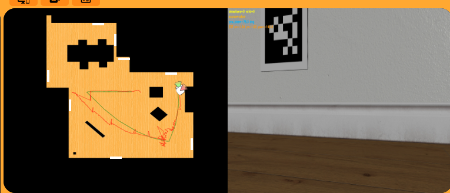

# 📍 Práctica 3: Localización Visual

---

## 👨‍💻 Autor

**Taref Bilel**
**Máster en Visión Artificial**
**Asignatura:** Visión Robótica

---

## 🤖 Localización visual con marcadores AprilTags

En esta práctica he trabajado con un sistema de localización visual usando AprilTags dentro de RoboticsAcademy / Unibotics.

La idea principal fue estimar la posición del robot usando la cámara y unos marcadores visuales colocados en el entorno.

Estos marcadores se llaman **AprilTags**. Son como cuadrados especiales con un dibujo dentro. El robot puede verlos con su cámara y saber qué marcador está mirando.

Cada AprilTag tiene una posición conocida en el mapa. Entonces, cuando el robot ve un marcador, puede usar esa información para calcular dónde está él mismo.

El objetivo fue estimar la pose 2D del robot:

```text
pose = (x, y, yaw)
```

Esto significa:

* `x`: posición del robot en el eje X.
* `y`: posición del robot en el eje Y.
* `yaw`: orientación del robot, es decir, hacia dónde está mirando.

En el simulador aparecen tres robots:

* 🟢 El robot verde representa la posición real, llamada Ground Truth.
* 🔵 El robot azul representa la odometría, que puede tener ruido.
* 🔴 El robot rojo representa la posición estimada por mi sistema.

El objetivo principal fue hacer que el robot rojo siguiera al robot verde lo mejor posible.

---

# 📌 Idea general del proyecto

En esta práctica hice que el robot usara su cámara para detectar AprilTags.

Cada AprilTag tiene una posición conocida en el mapa. Esa información está guardada en un archivo YAML del entorno.

La idea fue esta:

1. El robot mira con la cámara.
2. Si ve un AprilTag, detecta sus esquinas.
3. Como sé dónde está ese AprilTag en el mundo, puedo calcular dónde está la cámara.
4. Si sé dónde está la cámara, puedo estimar dónde está el robot.
5. Después muestro esa posición estimada en WebGUI.

De forma sencilla, el robot hace algo parecido a esto:

**“Veo este marcador. Sé dónde está este marcador en el mapa. Entonces puedo calcular dónde estoy yo.”**

---

# 🎯 Objetivo

El objetivo de esta práctica fue crear un sistema de localización visual para un robot móvil.

Yo quería que el robot pudiera saber su posición usando la cámara y los AprilTags.

Para conseguirlo, hice varias partes:

* Primero, cargué las posiciones conocidas de los AprilTags.
* Después, usé la cámara del robot para buscar marcadores.
* Luego, detecté los AprilTags en la imagen.
* Después, calculé la posición de la cámara respecto al marcador.
* Luego, transformé esa información para obtener la pose del robot en el mundo.
* Después, combiné la información visual con la odometría.
* También añadí suavizado para evitar movimientos bruscos en la estimación.
* Finalmente, mostré la pose estimada en WebGUI.

Mi objetivo no era solo detectar AprilTags, sino usar esos marcadores para corregir la posición del robot y hacer que la estimación fuera estable.

---

# 🧠 Explicación simple de la localización

La localización significa saber dónde está el robot.

Para explicarlo de forma simple, imagina que estás en una habitación y ves un cartel en la pared.

Si tú sabes exactamente dónde está ese cartel, puedes usarlo para saber dónde estás tú.

Por ejemplo:

* Si ves el cartel muy cerca, estás cerca de la pared.
* Si lo ves lejos, estás más lejos.
* Si lo ves a la derecha, sabes que estás mirando un poco hacia un lado.
* Si lo ves centrado, sabes que estás mirando más directamente hacia él.

Con los AprilTags pasa algo parecido.

El robot ve un marcador, y como el sistema ya sabe dónde está ese marcador en el mundo, puede calcular la posición del robot.

---

# 🔁 Flujo general del sistema

El sistema que hice sigue este proceso:

```text
Imagen de la cámara
    ↓
Preparación en gris
    ↓
Detección de AprilTags
    ↓
Estimación de pose con PnP
    ↓
Cálculo de la posición de la cámara
    ↓
Cálculo de la posición del robot
    ↓
Corrección de la odometría
    ↓
Visualización en WebGUI
```

Explicado de forma más simple:

1. Primero, el robot mira con la cámara.
2. Después, convierto la imagen para detectar mejor los marcadores.
3. Luego, busco AprilTags en la imagen.
4. Si encuentro un AprilTag válido, calculo su posición respecto a la cámara.
5. Después, uso la posición conocida del marcador para calcular dónde está el robot.
6. Luego, corrijo la estimación del robot.
7. Finalmente, muestro el robot rojo en WebGUI.

---

# 🏷️ Detección de AprilTags

Para detectar los AprilTags, usé la librería `pyapriltags`.

Esta librería permite encontrar marcadores AprilTag dentro de una imagen.

Un AprilTag tiene un identificador. Por ejemplo, un marcador puede tener ID 1, otro ID 2, etc.

Cuando el robot ve un marcador, el detector devuelve información importante como:

* El ID del marcador.
* Las esquinas del marcador en la imagen.
* El centro del marcador.
* El tamaño aproximado del marcador en la imagen.

Esto es importante porque con las esquinas del marcador puedo calcular la pose usando geometría.

---

## Por qué usé AprilTags

Usé AprilTags porque son muy útiles para localización visual.

Tienen varias ventajas:

* Son fáciles de detectar.
* Cada marcador tiene un ID único.
* Se pueden usar para saber la posición del robot.
* Funcionan bien en robótica.
* Permiten hacer una estimación de pose bastante precisa.

En esta práctica, los AprilTags fueron como puntos de referencia para el robot.

Es como si el robot tuviera señales en el mundo que le ayudan a orientarse.

---

# 📷 Modelo de cámara

Para calcular la posición del robot, también tuve que usar un modelo de cámara.

La cámara no es solo una imagen. También tiene parámetros internos.

Estos parámetros ayudan a saber cómo un punto 3D del mundo aparece en una imagen 2D.

La cámara tiene valores como:

* Distancia focal.
* Centro de la imagen.
* Tamaño de la imagen.

En esta práctica usé un modelo de cámara simple, llamado modelo pinhole.

No es necesario explicarlo con fórmulas complicadas. La idea simple es:

**el modelo de cámara ayuda a pasar de puntos en la imagen a información geométrica del mundo.**

Sin este modelo, sería difícil saber dónde está el AprilTag realmente respecto al robot.

---

# 📐 Estimación de pose con PnP

Después de detectar un AprilTag, usé PnP para estimar su posición.

PnP significa Perspective-n-Point.

La idea es que conozco dos cosas:

1. Las esquinas reales del AprilTag en 3D.
2. Las esquinas del AprilTag que aparecen en la imagen.

Como el tamaño del AprilTag es conocido, puedo usar esa información para calcular la posición del marcador respecto a la cámara.

En esta práctica, el tamaño del marcador era:

```text
TAG_SIZE = 0.24
```

Esto significa que el AprilTag tiene un tamaño conocido.

Con esto, el sistema puede calcular:

* A qué distancia está el marcador.
* En qué dirección está el marcador.
* Cómo está orientado respecto a la cámara.

---

## Explicación simple de PnP

Para entender PnP de forma sencilla, imagina que tienes una foto de una mesa cuadrada.

Si sabes el tamaño real de la mesa y ves cómo aparece en la foto, puedes calcular más o menos desde dónde se tomó la foto.

Con un AprilTag pasa algo parecido.

El marcador es cuadrado y tiene un tamaño conocido.
La cámara lo ve en la imagen.
Entonces, usando las esquinas del cuadrado, puedo estimar la posición de la cámara respecto al marcador.

---

# 🌍 Del marcador a la posición del robot

Después de calcular la posición del marcador respecto a la cámara, tuve que convertir esa información a la posición del robot en el mundo.

Esto es una parte muy importante.

El mapa ya sabe dónde está cada AprilTag.

Entonces, cuando el robot detecta un marcador, yo puedo hacer este razonamiento:

1. Sé dónde está el marcador en el mundo.
2. Sé dónde está la cámara respecto al marcador.
3. Entonces puedo calcular dónde está la cámara en el mundo.
4. Si sé dónde está la cámara, puedo estimar dónde está el robot.

Al final, obtengo la pose del robot:

```text
x, y, yaw
```

Esto es lo que quiero mostrar con el robot rojo.

---

# 🔁 Odometría y corrección visual

En esta práctica no dependí solamente de la visión.

También usé la odometría.

La odometría es una estimación del movimiento del robot usando sus movimientos internos. Por ejemplo, si el robot avanza, la odometría estima que su posición ha cambiado.

El problema es que la odometría puede tener error.

Con el tiempo, ese error puede crecer. Esto se llama deriva o drift.

Por eso, yo combiné odometría y visión.

La idea fue:

* Cuando el robot ve AprilTags, uso la visión para corregir la odometría.
* Cuando el robot no ve AprilTags, uso la odometría para seguir estimando el movimiento.

Esto es útil porque si el robot pierde un marcador durante un momento, la estimación no se queda congelada.

El sistema puede seguir usando la odometría hasta que aparezca otro marcador.

---

## Explicación simple

La odometría es como contar tus pasos.

Si caminas y cuentas tus pasos, puedes estimar dónde estás. Pero si te equivocas un poco en cada paso, al final tu posición puede tener error.

La visión con AprilTags es como mirar un cartel que te dice dónde estás.

Entonces, yo hice que el robot usara las dos cosas:

* La odometría para moverse entre marcadores.
* Los AprilTags para corregir el error.

Esto hace que la localización sea más estable.

---

# 🧭 Calibración del yaw

También trabajé con la orientación del robot, llamada `yaw`.

El `yaw` indica hacia dónde está mirando el robot.

Esta parte fue importante porque los sistemas de coordenadas pueden ser diferentes.

Por ejemplo:

* OpenCV puede usar un sistema de coordenadas.
* Gazebo puede usar otro sistema.
* El robot puede tener otra orientación de referencia.

Entonces, si no corrijo bien el yaw, el robot rojo puede aparecer girado o mal orientado.

Por eso añadí una calibración automática del yaw.

La idea fue ajustar poco a poco la orientación estimada para que coincidiera mejor con el movimiento real del robot.

---

# 🧪 Mejoras de robustez

Durante la práctica, añadí varias mejoras para hacer el sistema más estable.

Esto fue necesario porque la detección visual no siempre es perfecta.

A veces:

* El marcador se ve pequeño.
* El marcador se ve parcialmente.
* Hay ruido en la imagen.
* La estimación PnP puede dar un resultado raro.
* La pose puede saltar de forma brusca.

Por eso añadí filtros y comprobaciones.

---

## 1. Filtro por área del AprilTag

Primero comprobé el tamaño del marcador en la imagen.

Si el marcador se ve demasiado pequeño, la estimación puede ser mala.

Por eso, rechacé marcadores con área muy pequeña.

La idea fue:

**si el AprilTag está demasiado lejos o se ve muy pequeño, no confío mucho en él.**

---

## 2. Validación de PnP

También comprobé que la solución de PnP fuera válida.

No todos los resultados de PnP son buenos.

A veces puede dar una pose que no tiene sentido.

Entonces, añadí comprobaciones para aceptar solo resultados fiables.

---

## 3. Validación de profundidad positiva

También comprobé que la profundidad fuera positiva.

Esto significa que el marcador debe estar delante de la cámara, no detrás.

Si el cálculo dice que el marcador está detrás de la cámara, ese resultado no tiene sentido y lo rechazo.

---

## 4. Filtro de reproyección

También usé la idea de reproyección.

Esto significa comprobar si la pose calculada explica bien lo que veo en la imagen.

Si el error de reproyección es grande, significa que la estimación no es buena.

Entonces, rechazo ese resultado.

---

## 5. Rechazo de saltos visuales

También añadí un filtro para evitar saltos bruscos.

A veces, una detección mala puede hacer que la pose estimada salte mucho de golpe.

Por ejemplo, el robot rojo puede aparecer de repente muy lejos.

Eso no es realista.

Entonces, añadí un límite para rechazar cambios demasiado grandes.

Así el movimiento del robot rojo es más estable.

---

## 6. Suavizado de pose

También apliqué suavizado.

El suavizado sirve para que la pose estimada no cambie de forma demasiado brusca.

En vez de cambiar directamente a la nueva posición, mezclo un poco la posición anterior con la nueva.

Esto hace que el movimiento del robot rojo sea más suave y más fácil de seguir visualmente.

---

## 7. Fusión de varios tags

Si el robot detecta más de un AprilTag, puedo usar más información.

En vez de depender de un solo marcador, puedo combinar varios resultados.

Esto ayuda porque si un marcador tiene un poco de error, otro marcador puede compensar.

La fusión de varios tags hace que la estimación sea más robusta.

---

## 8. Evitación de obstáculos con láser

También añadí un comportamiento básico con el láser para evitar obstáculos.

Esto no es la parte principal de la localización, pero ayuda al robot a moverse de forma más segura por el entorno.

Si el robot detecta un obstáculo cerca, cambia su movimiento para evitar chocar.

---

# 🚗 Movimiento del robot

El robot no solo estima su posición, también se mueve por el entorno.

Yo definí un comportamiento simple:

* Si el robot ve un AprilTag, avanza despacio.
* Si no ve ningún AprilTag, gira para buscar uno.
* Si hay un obstáculo cerca, evita el obstáculo.

Esto permite que el robot siga explorando y buscando marcadores.

También intenté que el robot mantuviera el AprilTag más o menos centrado en la cámara.

Si el marcador está muy a un lado, el robot puede girar para verlo mejor.

---

# 🖥️ Visualización y depuración

También añadí información de depuración para entender qué estaba pasando.

Esto fue muy importante porque, cuando algo falla en localización, no siempre es fácil saber por qué.

En la visualización pude ver información como:

* Cuántos AprilTags se detectan.
* Cuántos tags son válidos.
* Qué ID tiene el marcador.
* La pose visual estimada.
* La pose final estimada.
* Información del yaw.
* La fuente de la pose.
* Los cuadros alrededor de los marcadores.

Esto me ayudó a corregir errores y mejorar el sistema.

También mostré la pose estimada usando WebGUI.

El robot rojo representa la pose calculada por mi algoritmo.

---

# 📂 Estructura del proyecto

La estructura del proyecto fue sencilla:

```text
P3_TarefBilel/
└── code.py
```

Todo el código principal está dentro de `code.py`.

---

# ▶️ Cómo ejecutar la práctica

Para ejecutar la práctica, seguí estos pasos:

1. Abrí RoboticsAcademy / Unibotics.
2. Entré en la práctica de Marker Based Visual Localization.
3. Copié el contenido de `code.py`.
4. Lo pegué en el editor de la práctica.
5. Ejecuté la simulación.
6. Observé la posición estimada en WebGUI.

La idea era comprobar si el robot rojo seguía al robot verde.

---

# ⚙️ Parámetros principales

Los parámetros principales que usé fueron:

```text
TAG_SIZE = 0.24
TAG_MIN_AREA = 180

FWD_SPEED = 0.15
TURN_SPEED = 0.35
OBS_DIST = 0.55

SEARCH_TURN_SPEED = 0.35
LOOP_HZ = 15

CORRECTION_ALPHA = 0.35
MAX_VISUAL_JUMP = 1.50
MAX_VISUAL_YAW_JUMP = 140 grados aproximadamente
```

Estos parámetros controlan cosas como:

* El tamaño del AprilTag.
* El área mínima para aceptar un marcador.
* La velocidad del robot.
* La distancia mínima a obstáculos.
* La velocidad de giro para buscar tags.
* La frecuencia del bucle.
* La suavidad de la corrección visual.
* El rechazo de saltos grandes.

---

# 📊 Resultados

Las siguientes imágenes muestran el comportamiento del sistema de localización en diferentes momentos.

En las imágenes:

* El robot verde representa la posición real.
* El robot rojo representa la posición estimada por mi sistema.
* El objetivo es que el robot rojo esté lo más cerca posible del robot verde.

---

## ✅ Resultado 1 — Detección inicial

Al principio, el robot detecta un AprilTag y empieza a calcular su posición.

En esta parte comprobé que la detección inicial funcionaba correctamente.

El robot rojo aparece cerca del robot verde, lo que significa que la estimación inicial es razonable.

Puntos importantes:

* El AprilTag se detecta correctamente.
* La pose inicial es estable.
* El robot rojo está cerca del Ground Truth.


---

## ✅ Resultado 2 — Actualización con visión

En este resultado, el robot se acerca al marcador y actualiza su pose usando la cámara.

Aquí la visión ayuda a corregir el error de la odometría.

Esto es importante porque la odometría sola puede desviarse poco a poco.

Puntos importantes:

* La estimación PnP funciona correctamente.
* La corrección visual reduce el error.
* La pose estimada sigue el movimiento del robot.


---

## ✅ Resultado 3 — Localización continua

En este resultado, el sistema sigue actualizando la pose mientras el robot se mueve.

El robot rojo continúa siguiendo al robot verde.

Esto muestra que el sistema no funciona solo al principio, sino durante el movimiento.

Puntos importantes:

* La trayectoria roja sigue la trayectoria real.
* El seguimiento es estable durante varios frames.
* La visión se combina con la odometría.


---

## ✅ Resultado 4 — Seguimiento en trayectoria larga

Aquí el robot sigue navegando durante más tiempo.

La localización se mantiene estable aunque el robot se mueva bastante.

También es importante que, si el robot pierde temporalmente un AprilTag, la odometría ayuda a continuar la estimación.

Puntos importantes:

* La pose estimada sigue siendo estable.
* El robot mantiene una localización coherente.
* La odometría evita que la estimación se quede parada.


---

## ✅ Resultado 5 — Obstáculos y bordes

En este resultado, el robot navega cerca de paredes, obstáculos o bordes del entorno.

Esto puede ser más difícil porque los AprilTags pueden verse parcialmente o desde ángulos peores.

Aun así, el sistema mantiene una estimación funcional.

Puntos importantes:

* La pose sigue funcionando cerca de paredes.
* La corrección visual estabiliza la trayectoria.
* El sistema puede trabajar aunque el marcador no se vea perfectamente.


---

## ✅ Resultado 6 — Estado final de localización

En el resultado final, el robot mantiene una estimación estable después de varias actualizaciones visuales.

El robot rojo sigue cerca del robot verde.

Esto muestra que el sistema consiguió combinar bien la visión y la odometría.

Puntos importantes:

* La pose estimada sigue cerca del Ground Truth.
* El sistema se mantiene robusto durante un movimiento largo.
* La odometría se corrige continuamente con AprilTags.



---

# 🎥 Video de demostración

En este video se puede ver el robot realizando la localización visual con AprilTags dentro del simulador.

El robot rojo representa la pose estimada por mi sistema, y el robot verde representa la posición real.

<p align="center">
  
</p>

Si el GIF no se carga correctamente, también se puede abrir el video aquí:

👉 [Ver video de la práctica 3](P3_Video.webm)

---

# 📈 Observaciones finales

Durante la práctica observé varias cosas importantes.

Primero, vi que la detección de AprilTags era una parte fundamental. Si el marcador se detecta bien, la estimación mejora mucho.

También observé que la odometría sola no es suficiente, porque puede acumular error con el tiempo.

Por eso, la combinación de visión y odometría fue muy importante.

Cuando el robot ve un AprilTag, la visión corrige la posición.
Cuando no ve un AprilTag, la odometría permite seguir estimando el movimiento.

También observé que el suavizado ayuda a evitar movimientos bruscos del robot rojo.

Los filtros de saltos visuales fueron importantes porque evitaron que una mala detección moviera la pose estimada a una posición incorrecta.

En general, el sistema funcionó mejor cuando:

* El AprilTag se veía bien.
* El marcador tenía un área suficiente.
* La pose PnP era válida.
* La corrección visual no era demasiado brusca.
* La odometría ayudaba cuando no había marcador visible.

---

# 🚀 Tecnologías utilizadas

En esta práctica utilicé varias herramientas:

* Python
* OpenCV
* NumPy
* PyYAML
* pyapriltags
* Robotics Academy HAL API
* Robotics Academy WebGUI API
* Frequency API

Python fue el lenguaje principal.

OpenCV me sirvió para trabajar con la imagen y la estimación geométrica.

NumPy me ayudó con cálculos numéricos.

PyYAML me permitió leer el archivo donde estaban las posiciones de los AprilTags.

pyapriltags me sirvió para detectar los marcadores en la imagen.

HAL API me permitió obtener datos del robot y moverlo.

WebGUI me permitió mostrar la pose estimada.

Frequency API me ayudó a controlar la frecuencia del bucle.

---

# 📊 Resumen de lo que hice

En resumen, en esta práctica hice lo siguiente:

1. Primero entendí que el objetivo era localizar el robot usando AprilTags.
2. Después cargué las posiciones conocidas de los marcadores.
3. Luego obtuve la imagen de la cámara del robot.
4. Después convertí la imagen para detectar mejor los tags.
5. Luego usé `pyapriltags` para encontrar los AprilTags.
6. Después comprobé si los tags detectados eran válidos.
7. Luego usé PnP para estimar la posición del marcador respecto a la cámara.
8. Después calculé la posición de la cámara en el mundo.
9. Luego estimé la pose del robot.
10. Después combiné esa pose visual con la odometría.
11. También añadí suavizado para evitar saltos.
12. Añadí filtros para rechazar malas detecciones.
13. Añadí un comportamiento para buscar tags cuando no se ven.
14. Añadí evitación básica de obstáculos.
15. Finalmente mostré la pose estimada en WebGUI.

---

# ✅ Conclusiones

En esta práctica conseguí implementar un sistema de localización visual basado en AprilTags.

El robot pudo usar su cámara para detectar marcadores y calcular su posición en el entorno.

Primero detecté los AprilTags en la imagen. Después usé la información del mapa para saber dónde estaban esos marcadores en el mundo.

Luego calculé la posición del robot usando geometría y PnP.

También combiné la información visual con la odometría. Esto fue importante porque la visión no siempre está disponible. A veces el robot no ve ningún marcador, y en esos momentos la odometría permite continuar la estimación.

Además, añadí filtros, suavizado y rechazo de saltos para hacer la estimación más estable.

El resultado final fue que el robot rojo pudo seguir bastante bien al robot verde durante la navegación.

Esta práctica me ayudó a entender cómo un robot puede saber dónde está usando referencias visuales del entorno.

---

# 🧠 Explicación simple de todo el trabajo

De forma muy sencilla, yo hice que el robot usara la cámara para buscar carteles especiales llamados AprilTags.

Cada AprilTag tenía una posición conocida en el mapa.

Cuando el robot veía uno, yo calculaba desde dónde lo estaba viendo.

Después usaba esa información para saber dónde estaba el robot.

También usé la odometría para que el robot no se perdiera cuando no veía ningún marcador.

Entonces, el sistema funcionaba así:

```text
mirar con la cámara → encontrar AprilTag → calcular posición → corregir odometría → mostrar robot rojo
```

La idea es como si el robot mirara una señal en la pared y pensara:

**“Sé dónde está esta señal, entonces puedo calcular dónde estoy yo.”**

En resumen, yo hice un sistema que combina visión y movimiento para estimar la posición del robot de forma estable.

# 🎥 Video de demostración

En este video se puede ver el robot realizando la localización visual con AprilTags dentro del simulador.

https://drive.google.com/file/d/1xq4trsp5EpbQUjDrnJGZAgLv41Gdn_-K/view?usp=sharing
