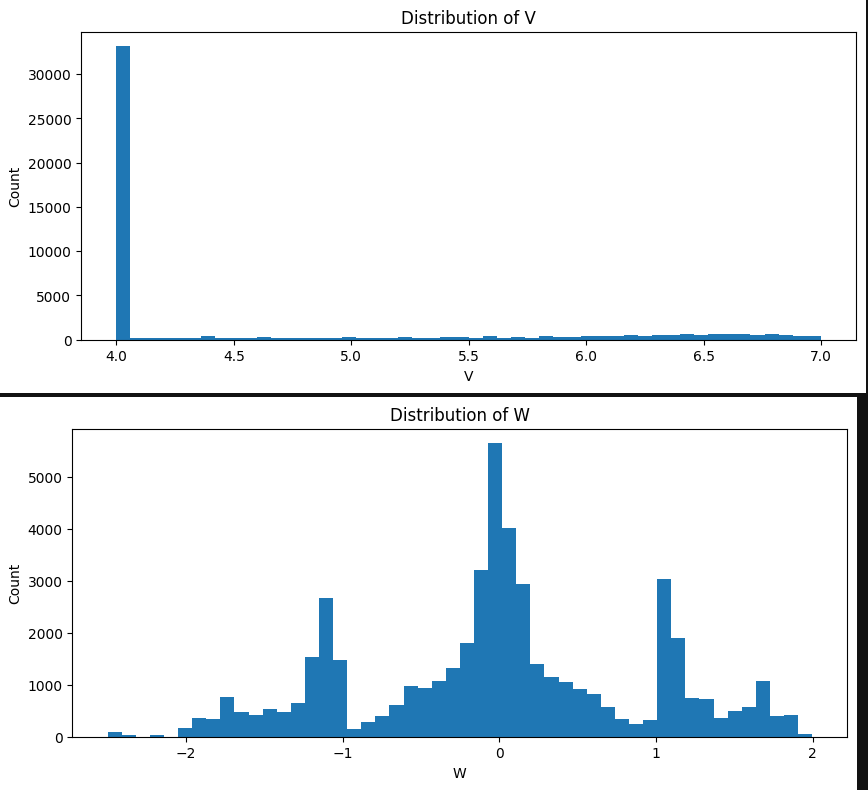
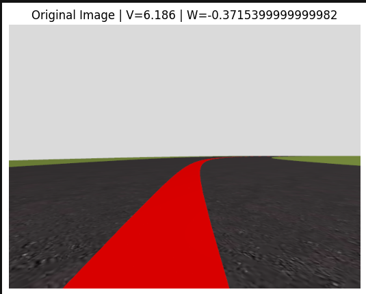
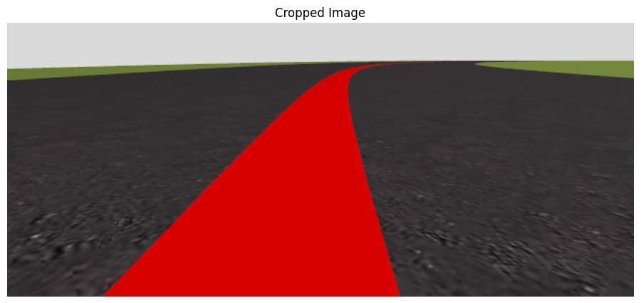
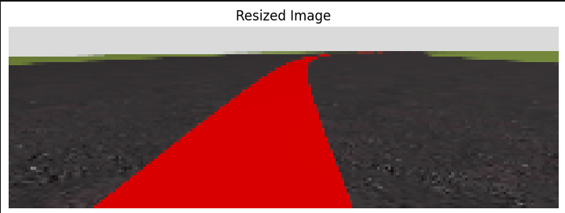
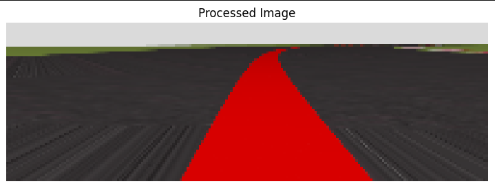
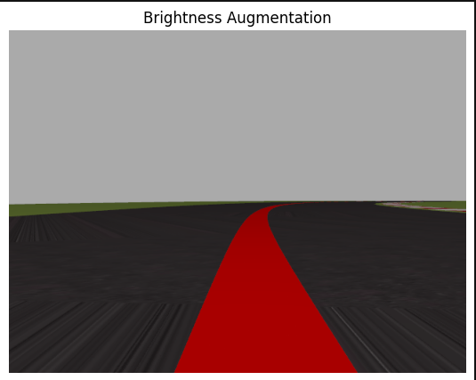
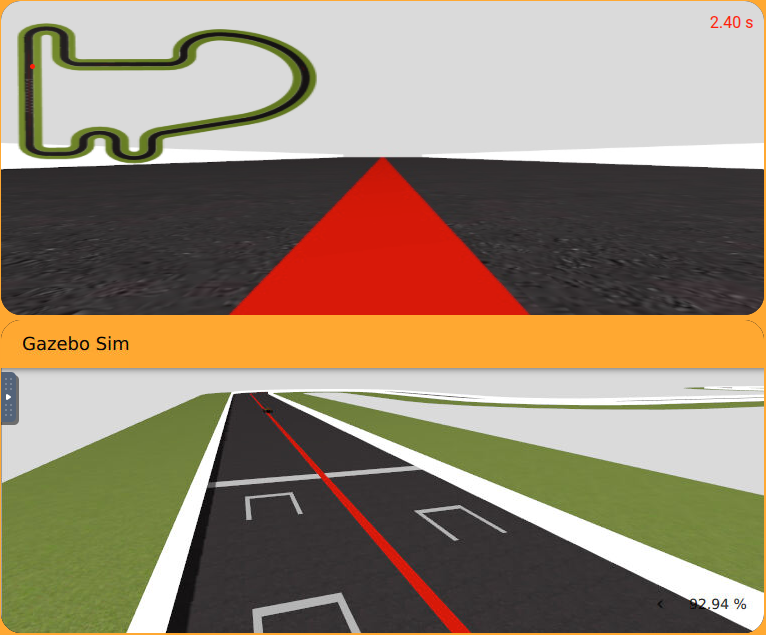
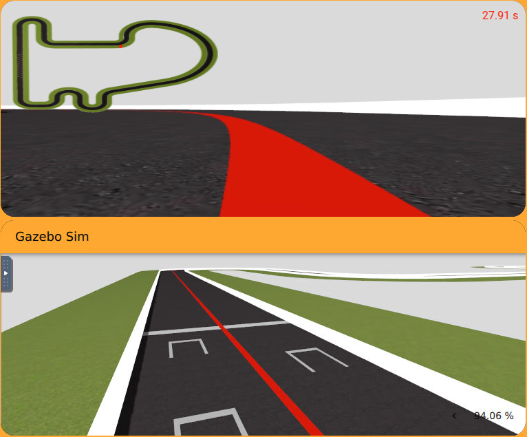
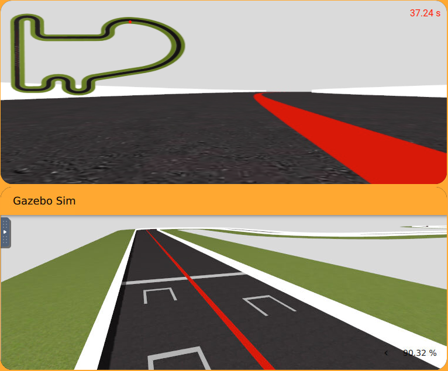
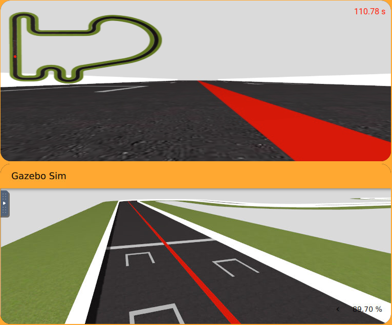

# End-to-End Visual Control using Deep Learning

## Introduction

This project implements an autonomous driving system using Deep Learning for the RoboticsAcademy / Unibotics platform.  
The objective is to train a neural network capable of predicting the robot control commands directly from camera images without using classical computer vision or PID controllers during inference.

The model learns the relationship between:
- Input: front camera image
- Output:
  - Linear velocity `v`
  - Angular velocity `w`

The project was developed using:
- Python
- PyTorch
- OpenCV
- ONNX
- Unibotics / RoboticsAcademy

---

# Objective

The goal of this project is to create an End-to-End autonomous driving system capable of following a racing circuit using only visual information from the front camera.

Unlike classical approaches based on:
- color segmentation
- centroid extraction
- PID control

this system uses a deep neural network that directly predicts the vehicle commands from raw images.

The final trained model is exported to ONNX format and integrated into the RoboticsAcademy simulator for real-time inference.

---

# Dataset

Two datasets are provided in the practice.

## Simple Circuit Dataset

The dataset is divided into:
- `train_images_part_01` → `train_images_part_07`
- `train.csv`
- `test_images`
- `test.csv`

The CSV files contain:
- image path
- linear velocity `v`
- angular velocity `w`

---

## Combine Circuit Dataset

The dataset contains:
- `images_part_01` → `images_part_10`
- `label.csv`

Additional adjustment data may also be provided for sharp turns.

The dataset includes:
- camera images
- linear velocity commands
- angular velocity commands

Dataset size used:
- **50,000 images**

---

# Project Pipeline

```text
Dataset
   ↓
Preprocessing
   ↓
Data Augmentation
   ↓
PyTorch Dataset & DataLoader
   ↓
PilotNet CNN
   ↓
Training
   ↓
Validation
   ↓
Export to ONNX
   ↓
Real-Time Inference in Unibotics
```

---

# Methodology

# 1. Dataset Loading

The labels are loaded using Pandas from the CSV file.

```python
import pandas as pd

df = pd.read_csv("label.csv")

print(df.head())
```

Each row contains:
- image path
- linear velocity
- angular velocity

Example:

| image | v | w |
|---|---|---|
| image_1.png | 4.0 | -0.74 |

---

# 2. Image Preprocessing

Before training, all images are preprocessed to ensure consistency and improve learning stability.

The preprocessing pipeline includes:

## a) Cropping

The upper part of the image (mainly sky and irrelevant background) is removed.

```python
cropped = image[200:, :, :]
```

This allows the network to focus only on:
- the road
- the red line
- the driving area

while removing:
- sky
- horizon
- irrelevant background

---

## b) Resizing

Images are resized to:

```python
(200, 66)
```

This resolution is inspired by NVIDIA PilotNet architecture.

```python
resized = cv2.resize(cropped, (200, 66))
```

Resizing reduces:
- memory usage
- training time
- computational complexity

while preserving important driving features.

---

## c) Normalization

Pixel values are normalized to the range:

```python
[0, 1]
```

```python
img = img.astype(np.float32) / 255.0
```

Normalization improves:
- training stability
- convergence speed
- gradient behavior

---

# 3. Data Augmentation

To improve generalization and robustness, data augmentation techniques are applied.

## Brightness Augmentation

Random brightness variation is used to simulate different lighting conditions.

```python
factor = 0.5 + np.random.uniform()
```

This helps the model become more robust against:
- shadows
- illumination changes
- reflections

---

# 4. Full Preprocessing Function

A complete preprocessing function was implemented.

```python
def preprocess_image(img):

    img = cv2.cvtColor(img, cv2.COLOR_BGR2RGB)

    img = img[200:, :, :]

    img = cv2.resize(img, (200, 66))

    img = img.astype(np.float32) / 255.0

    return img
```

This preprocessing pipeline is used both:
- during training
- during inference in Unibotics

to ensure consistency.

---

# 5. PyTorch Dataset Class

A custom PyTorch Dataset class was implemented.

The dataset:
- loads images
- preprocesses them
- converts them into tensors
- returns labels `(v, w)`

```python
class DrivingDataset(Dataset):

    def __init__(self, dataframe, root_dir):

        self.df = dataframe
        self.root_dir = root_dir

    def __len__(self):

        return len(self.df)

    def __getitem__(self, idx):

        row = self.df.iloc[idx]

        image_path = os.path.join(
            self.root_dir,
            row["image"]
        )

        img = cv2.imread(image_path)
        img = cv2.cvtColor(img, cv2.COLOR_BGR2RGB)

        img = preprocess_image(img)

        img = np.transpose(img, (2, 0, 1))

        img = torch.tensor(img, dtype=torch.float32)

        labels = torch.tensor(
            [row["v"], row["w"]],
            dtype=torch.float32
        )

        return img, labels
```

---

# 6. Tensor Shapes

Example tensor shapes:

```python
torch.Size([3, 66, 200])
torch.Size([2])
```

Meaning:
- 3 channels (RGB)
- 66 height
- 200 width

The labels contain:
- linear velocity `v`
- angular velocity `w`

---

# 7. DataLoader

Batch loading was implemented using DataLoader.

```python
train_loader = DataLoader(
    train_dataset,
    batch_size=64,
    shuffle=True
)
```

Example batch shapes:

```python
torch.Size([64, 3, 66, 200])
torch.Size([64, 2])
```

Dataset split:
- Training: 40,000 images
- Validation: 10,000 images

---

# 8. Deep Learning Model

The architecture used is inspired by NVIDIA PilotNet.

The model receives an RGB image and predicts:
- linear velocity `v`
- angular velocity `w`

The network contains:
- convolutional layers
- ELU activations
- fully connected layers

---

# 9. PilotNet Architecture

```python
class PilotNet(nn.Module):

    def __init__(self):
        super(PilotNet, self).__init__()

        self.conv_layers = nn.Sequential(

            nn.Conv2d(3, 24, kernel_size=5, stride=2),
            nn.ELU(),

            nn.Conv2d(24, 36, kernel_size=5, stride=2),
            nn.ELU(),

            nn.Conv2d(36, 48, kernel_size=5, stride=2),
            nn.ELU(),

            nn.Conv2d(48, 64, kernel_size=3),
            nn.ELU(),

            nn.Conv2d(64, 64, kernel_size=3),
            nn.ELU()
        )

        self.fc_layers = nn.Sequential(

            nn.Flatten(),

            nn.Linear(1152, 100),
            nn.ELU(),

            nn.Linear(100, 50),
            nn.ELU(),

            nn.Linear(50, 10),
            nn.ELU(),

            nn.Linear(10, 2)
        )

    def forward(self, x):

        x = self.conv_layers(x)

        x = self.fc_layers(x)

        return x
```

Final output:

```python
[v, w]
```

---

# 10. Training Process

The model was trained using:
- Mean Squared Error (MSE Loss)
- Adam optimizer

```python
criterion = nn.MSELoss()

optimizer = torch.optim.Adam(
    model.parameters(),
    lr=1e-4
)
```

---

# 11. Training Results

Training results:

```text
Epoch [1/3] | Train Loss: 0.0553 | Val Loss: 0.0560
Epoch [2/3] | Train Loss: 0.0507 | Val Loss: 0.0492
Epoch [3/3] | Train Loss: 0.0471 | Val Loss: 0.0453
```

The best model was saved automatically:

```python
torch.save(model.state_dict(), "pilotnet_best.pth")
```

---

# 12. Model Evaluation

The predictions were compared against the real commands.

Example:

```text
REAL: [6.80 0.002]
PRED: [6.74 -0.013]
```

The model successfully learned:
- steering behavior
- road following
- velocity estimation

---

# 13. Visualization

## Original Image



---

## Cropped Image



---

## Resized Image



---

## Normalized / Processed Image



---

## Brightness Augmentation



---

## Tensor and Batch Visualization



# 14. Export to ONNX

The trained PyTorch model was exported to ONNX format.

```python
torch.onnx.export(
    model,
    dummy_input,
    "model_single.onnx",
    export_params=True,
    opset_version=15
)
```

The ONNX format is required by RoboticsAcademy / Unibotics.

Final exported model:

```text
model_single.onnx
```

Model size:
- approximately 1 MB

---

# 15. ONNX Runtime Inference

The ONNX model was loaded using ONNX Runtime.

```python
ort_session = onnxruntime.InferenceSession(
    model_path,
    providers=["CPUExecutionProvider"]
)
```

---

# 16. Integration into Unibotics

The ONNX model was integrated into the RoboticsAcademy simulator.

Inference pipeline:

```text
Camera Image
    ↓
Preprocessing
    ↓
ONNX Inference
    ↓
Predicted V,W
    ↓
HAL.setV()
HAL.setW()
```

---

# 17. Final Inference Code

```python
while True:

    image = HAL.getImage()

    input_tensor = preprocess(image)

    output = ort_session.run(
        None,
        {input_name: input_tensor}
    )

    prediction = output[0][0]

    v = float(prediction[0])
    w = float(prediction[1])

    HAL.setV(v)
    HAL.setW(w)

    WebGUI.showImage(image)

    Frequency.tick(30)
```

---

# Results

The trained model was capable of:
- following the circuit
- predicting smooth steering commands
- maintaining stable autonomous driving behavior

The model achieved:
- low validation loss
- stable inference
- real-time autonomous driving


---

## Real vs Predicted V



---

## Real vs Predicted W



---

## ONNX Model Running in Unibotics



---

## Autonomous Driving Result



# Technologies Used

- Python
- PyTorch
- OpenCV
- NumPy
- ONNX
- ONNX Runtime
- RoboticsAcademy
- Unibotics

---

# Future Improvements

Possible future improvements include:
- training with more epochs
- larger datasets
- temporal models (CNN + LSTM)
- obstacle avoidance
- domain adaptation to real robots
- reinforcement learning approaches

---

# Conclusion

This project demonstrates how Deep Learning can replace traditional computer vision and control pipelines in autonomous driving tasks.

The neural network successfully learned to predict driving commands directly from images and was deployed in real time inside the RoboticsAcademy environment using ONNX inference.
